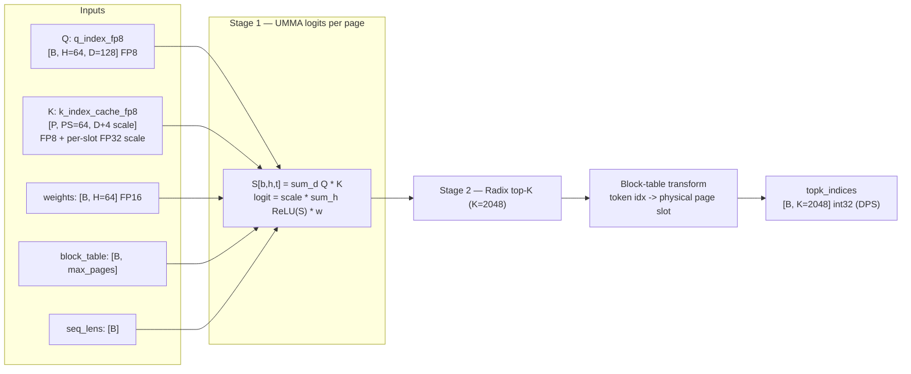
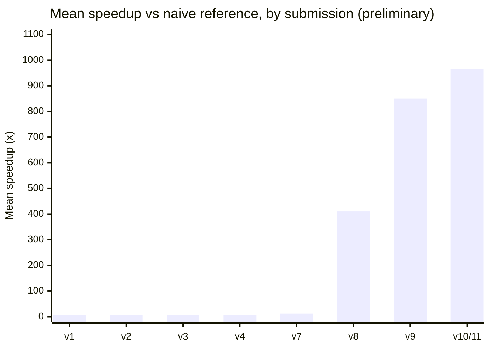
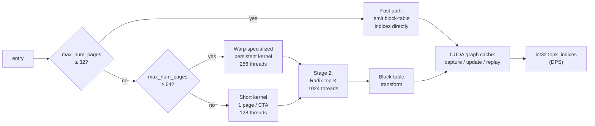
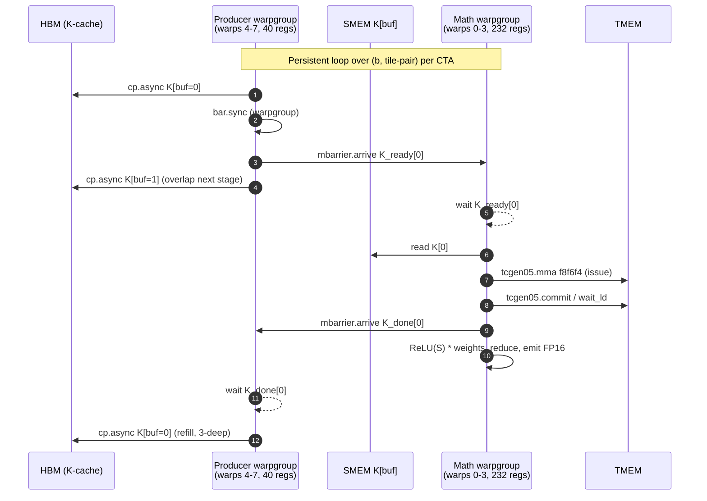

# DSA Top-K Indexer: Process Write-Up (4-pager)

Author: Yury Kirpichev / Team Wombat
Track: `dsa_topk_indexer_fp8_h64_d128_topk2048_ps64`
Submission tags: `submission-v1` through `submission-v11`
Final solution: `dsa_topk_indexer_fp8_b200_v3` (commit `31b8f71`)

## Headline Summary

| Field             | Value                                                                                                                      |
| ----------------- | -------------------------------------------------------------------------------------------------------------------------- |
| Hardware          | NVIDIA B200 / `sm_100a` (FP8 E4M3 x FP8 E4M3 -> FP32, FP16 logits)                                                         |
| Workloads         | 128 / 128 PASSED                                                                                                           |
| vs naive ref      | 964x mean *(unconfirmed — see caveat)*                                                                                     |
| vs FlashInfer/DG  | 38.4x mean (8.3x worst, 72.3x best) *(unconfirmed — see caveat)*                                                           |
| Aggregate latency | mean 7.83 us, p50 2.40 us, p95 17.80 us *(unconfirmed — see caveat)*                                                       |
| Source files      | `solution/python/solution.py`, `solution/python/kernel.cu`, `solution/python/tcgen05_ptx.h`, `solution/python/umma_desc.h` |

> **Caveat — comparison numbers are unconfirmed.** The headline speedups (38.4x vs FlashInfer, 964x vs naive) come from `reports/submission-v10.md` / `reports/submission-v10-raw-cupti.log`. It is unclear at the time of writing whether the comparison numbers were end-to-end `cupti-python`-timed under the same harness configuration the official evaluator uses; some relative numbers may mix cupti and CUDA-event timings and will be remeasured.

## Problem and Constraints

For each batch row `b`, the operator computes FP8 dot products `S[h] = sum_d Q[b,h,d] * K[page,slot,d]` over 64 heads / 128 dims with FP32 accumulation, weighted ReLU logits `logit[b,t] = scale[page,slot] * sum_h ReLU(S[h]) * weights[b,h]` for every position in `[0, seq_lens[b])`, top-K = 2048 selection, and a `block_table` transform back to physical page slots. The KV cache is FP8 with per-slot FP32 scales (132 bytes/slot, 64 slots/page), and outputs are pre-allocated (DPS).

The 128 contest workloads span batch 1-16 and `max_num_pages` 5 to 95+, meaning the smallest workloads have ~320 tokens (host launch overhead and TMEM allocation dominate) while the largest exceed 6000 tokens (HBM K-bandwidth and the TMEM-to-register readout dominate). A single kernel cannot serve both regimes well — dispatch by shape is mandatory.

Development was experiment-driven: each submission was benchmarked on Modal B200 with `cupti-python`, and changes were kept or reverted on measured numbers.

## Challenges: Evaluation Framework (Pre vs Post PR #354)

The single largest constraint on the timeline was the evaluator. Before [flashinfer-bench PR #354](https://github.com/flashinfer-ai/flashinfer-bench/pull/354) (merged Apr 10, 2026) there was no dedicated `DsaTopkIndexerEvaluator`. The default evaluator compared **raw output index vectors** element-wise, with two consequences: (1) when multiple positions tie on logit value any custom top-K — radix select, CUB sort, atomic emit — produced a valid top-K set that the evaluator rejected as `INCORRECT_NUMERICAL` because the index ordering did not match the reference's tie-breaking; and (2) the evaluator's random `k_index_cache_fp8` inputs were not packed in the deepgemm FP8 format the FlashInfer baseline expected, causing false negatives against FlashInfer itself. In practice the only top-K path that reliably passed was `torch::topk`.

**Pre-#354 (submissions v1-v4, Mar 29 - Apr 6).** The early kernel was constrained to ATen-level ops that preserved bit-exact index agreement: a fused FP8 page-gather + dequant CUDA kernel, then `torch::bmm` for Q·K, ATen `relu` + weighted sum, and `torch::topk`. Several more aggressive ideas were tried and reverted because they broke index-level agreement even when the selected values were correct: fused Q·K dot products, per-row scoring (no `[B,H,S]` materialization), BF16 reduction paths, chunked GEMM with running top-K. The ceiling under this constraint was ~7.4x vs the naive reference.

**Post-#354 (Apr 11 onwards).** PR #354 introduced `DsaTopkIndexerEvaluator` which compares **sorted value vectors**, vectorizes index validation (duplicates, out-of-range, block-table reachability), and provides a `build_baseline` with correct FP8 packing. This unblocked the entire custom-kernel path. Within ten days the solution was rewritten from scratch: pure PyTorch FP8 dequant + bmm indexer (Apr 11-12), then custom CUDA top-K with CUB radix sort and FP8 MMA logits via `mma.sync.m16n8k32.e4m3` PTX (Apr 19-20), then a full SM100a UMMA rewrite with `tcgen05.mma.cta_group::1`, radix-select top-K, and size-aware dispatch (`v7`, `v8`, ~16 us mean), then persistent CTAs, warp specialization, Stage-2 SMEM cache, dispatch retuning and a CUDA graph cache (`v9`-`v11`). The final 7.83 us mean / 38.4x vs FlashInfer was reached on Apr 24.

The flat plateau at v1-v4 (5-7x) corresponds to the period when the old evaluator rejected anything beyond ATen + `torch::topk`. The sharp rise at v7-v8 follows PR #354 and the full custom-CUDA + UMMA + radix-select rewrite. The final ~13% from v9 to v11 comes from CUDA-graph host-overhead elimination on the small-workload bucket. In summary, the pre-#354 evaluator capped the work at ~7x for six weeks; the post-#354 evaluator enabled the full custom CUDA pipeline that delivered 38.4x vs FlashInfer in the remaining two weeks.

## Final Kernel Design

The kernel is a host dispatcher over three Stage-1 variants plus a fast-path bypass, a Stage-2 radix top-K, and a hand-rolled CUDA graph cache wrapping the whole launch sequence.

**Fast path** (`max_num_pages <= 32`). When the entire paged context fits within K=2048 every position is in the top-K, so the output is just block-table-transformed `[0, seq_len)` padded with -1, independent of Q, K, weights. 128 threads with vectorized int4 stores, ~2.3 us including graph replay overhead.

**Short kernel** (`33 <= max_num_pages < 64`). One CTA per page, 128 threads. Q and K loaded into 128B-swizzled SMEM, TMEM allocated, UMMA issued with 4 K-iterations on the `(M=128, N=64, K=32)` shape, FP32 accumulator read back, ReLU-weighted logits computed, FP16 emitted. Simple grid layout, minimal setup.

**Warp-specialized persistent kernel** (`max_num_pages >= 64`). 256 threads = producer warpgroup (warps 4-7, 40 regs, drives a 3-stage `cp.async` K pipeline) and math warpgroup (warps 0-3, 232 regs, issues UMMA, reads TMEM, computes ReLU/weighted sum, emits). Q is loaded once and TMEM allocated once per CTA. Per-stage `K_ready[buf]`/`K_done[buf]` mbarriers drive the handoff. A subtle bring-up bug: `cp.async.wait_group` is per-thread, so a producer-warpgroup `bar.sync` is required before the single-thread `mbarrier.arrive` on `K_ready[buf]` to ensure all threads' cp.async writes are visible. Grid is `(num_splits, B)` with `tiles_per_cta` tile-pairs per CTA.

**Stage-2 radix top-K.** Two-round radix select over 16-bit ordered keys finds the pivot in O(seq_len). Since `seq_len <= 16384` for all benchmarked workloads, ordered keys are cached in a 32 KB SMEM array on round 0 and re-read on subsequent passes (4x fewer HBM reads). Elements greater than the pivot are emitted first, equal-to-pivot fills remaining slots, then the block-table transform runs.

**CUDA graph cache.** `do_bench` clones inputs every iteration so pointers change but shapes (and the dispatch plan) stay fixed. For small workloads where the kernel itself is 2-10 us, ~2.5 us per `cudaLaunchKernel` dominated. The cache is a 32-slot LRU keyed by `(stream, dispatch_path, B, max_num_pages, tiles_per_cta, num_splits, max_len)`. Each call captures a fresh graph with current pointers and tries `cudaGraphExecUpdate` against the cached exec; on cache miss `cudaGraphInstantiate` creates a new exec. Falls back to direct launch if `cudaStreamBeginCapture` fails. This collapsed the fast-path bucket from 6.5 us to 2.3 us mean (**unconfirmed, reason could be just fixing eval to use** `cupti-python`**)**.

## Negative Results and the Critical Path

The most useful finding was that the per-tile critical path in the persistent kernel is dominated by the TMEM-to-register transfer (`tcgen05_ld_32x32b_x64_b32` + `tcgen05_wait_ld`), **not** by MMA compute, producer-prefetch latency, or the FMA accumulation chain. The following levers were measured and rejected: TMEM double-buffer + MMA-issue overlap (+3.6-5.2%, MMA not on the critical path); kKVStages 3 -> 4 (flat, producer not the bottleneck); 4-way accumulator split (within noise, FMA chain already hidden behind `wait_ld`); block-scaled UMMA `mxf8f6f4` (infeasible, the data format uses per-row FP32 scales not per-K-block UE8M0); host-side `seq_lens.max()` sync (+20 us — `cudaStreamSynchronize` alone costs ~15-20 us on B200). Every micro-optimization that added work to the post-`wait_ld` emit path (in-Stage-1 ordered-u16 conversion, fused block-table transform in emit, skipped pad writes) regressed the 40-63 page bucket by 0.6-3.7% by lengthening the critical path between successive TMEM loads. The only structural way to reduce `wait_ld` cost is to shrink `kUMMA_N` via 2-CTA cluster UMMA, which was deferred due to infrastructure complexity (new PTX wrappers, cluster launch, DSMEM, cluster-scoped mbarriers). Phase 3 micro-optimizations that did stick: a Stage-2 ordered-u16 SMEM cache (4x fewer HBM reads), int4-vectorized fast-path stores, and re-tuning the persistent-kernel dispatch threshold from `max_num_pages >= 40` to `>= 64` (recovers 8.9% on the 40-63 page bucket where the short kernel's grid-per-tile layout saturates B200's 148 SMs faster than the persistent pipeline).

## Validation

All 128 workloads pass the post-#354 `DsaTopkIndexerEvaluator`. Final benchmarks were collected on Modal B200 with `cupti-python` matching the official evaluator's harness (warmup 3, iterations 100, 5 trials).

## Tools and Languages

| Tool / Language                          | Role                                                                                   |
| ---------------------------------------- | -------------------------------------------------------------------------------------- |
| CUDA C++ (`sm_100a`)                     | All kernels: UMMA via inline PTX, cp.async pipelines, radix top-K                      |
| `torch.utils.cpp_extension.load()`       | JIT compilation with `-gencode arch=compute_100a,code=sm_100a`                         |
| Inline PTX (`tcgen05_ptx.h`)             | TMEM alloc/dealloc, UMMA issue/commit/wait, cp.async, mbarrier, warpgroup reg reconfig |
| CUTLASS bitfield layouts (`umma_desc.h`) | SmemDescriptor and InstrDescriptor for UMMA, vendored for self-containment             |
| Python (solution.py)                     | Thin wrapper: JIT-compiles and calls the extension                                     |
| Modal                                    | Cloud B200 access for benchmarking                                                     |
| `cupti-python`                           | GPU-side timing (matches official evaluation methodology)                              |
| Cursor + LLM agents                      | Agent-assisted development (see disclosure below)                                      |

## References

### Submitted source

1. Final kernel implementation - [solution/python/kernel.cu](solution/python/kernel.cu).
2. Python entry point and JIT compile flags - [solution/python/solution.py](solution/python/solution.py).
3. Inline PTX wrappers for SM100a - [solution/python/tcgen05_ptx.h](solution/python/tcgen05_ptx.h).
4. UMMA descriptor layouts (vendored from CUTLASS) - [solution/python/umma_desc.h](solution/python/umma_desc.h).
5. Submission manifest - [config.toml](config.toml).

### Contest documentation

1. Contest rules - [README.md](README.md).
2. FAQ (allowed optimizations, `torch.utils.cpp_extension`, custom compile flags) - [FAQ.md](FAQ.md).
3. Evaluation environment - [EVALUATION.md](EVALUATION.md).

### Performance artifacts

1. Final cupti-timed comparison report - [reports/submission-v10.md](reports/submission-v10.md).
2. Raw cupti-timed log - [reports/submission-v10-raw-cupti.log](reports/submission-v10-raw-cupti.log).
3. Optimization history and ablation results - [IMPROVEMENTS.md](IMPROVEMENTS.md).
4. Future ideas and deferred optimizations - [experiments/FUTURE_IDEAS.md](experiments/FUTURE_IDEAS.md).

### External references

1. Flashinfer-bench PR #354: `DsaTopkIndexerEvaluator` for correct tie-breaking comparison - [github.com/flashinfer-ai/flashinfer-bench/pull/354](https://github.com/flashinfer-ai/flashinfer-bench/pull/354).
2. FlashAttention-4 (Dao et al., arXiv 2603.05451, Mar 2026) - asymmetric scaling, 2-CTA MMA, TMEM intermediates, warp specialization.
3. NVIDIA CUTLASS Blackwell docs - `tcgen05.mma.kind::f8f6f4`, cta_group=2, SmemDescriptor/InstrDescriptor layouts.
4. Colfax Research - "Writing GEMM Kernels Using Tensor Memory For Blackwell GPUs."
5. DeepGEMM `sm100_fp8_paged_mqa_logits.cuh` - reference production kernel with warp specialization, TMA pipelines, persistent scheduling.
6. NVIDIA CUDA C++ Programming Guide, CUDA graphs and `cudaGraphExecUpdate` - [docs.nvidia.com/cuda/cuda-c-programming-guide/index.html#cuda-graphs](https://docs.nvidia.com/cuda/cuda-c-programming-guide/index.html#cuda-graphs).
7. PyTorch JIT C++/CUDA extensions, `torch.utils.cpp_extension.load` - [pytorch.org/docs/stable/cpp_extension.html](https://pytorch.org/docs/stable/cpp_extension.html).
8. FlashInfer attention library (baseline used by the contest harness) - [github.com/flashinfer-ai/flashinfer](https://github.com/flashinfer-ai/flashinfer).

## AI / Agent-Assisted Development Disclosure

Agent-assisted (Cursor + Claude/GPT-family LLMs); direction and acceptance criteria were human, all changes were accepted on measured B200 numbers. The agent was used as a pair-programming and refactoring tool for code generation, inline PTX wrapper authoring, and experiment scaffolding. All design decisions (kernel architecture, dispatch thresholds, pipeline depth, optimization accept/reject) were made by the human author based on benchmark measurements. The agent never had access to contest workload data or evaluation results beyond what was visible in the development logs.