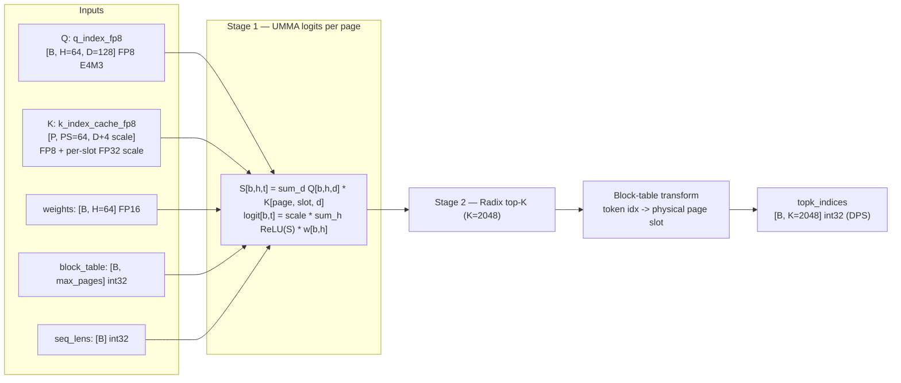
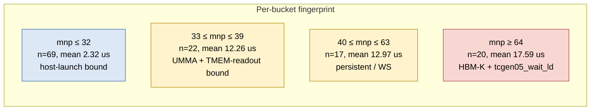
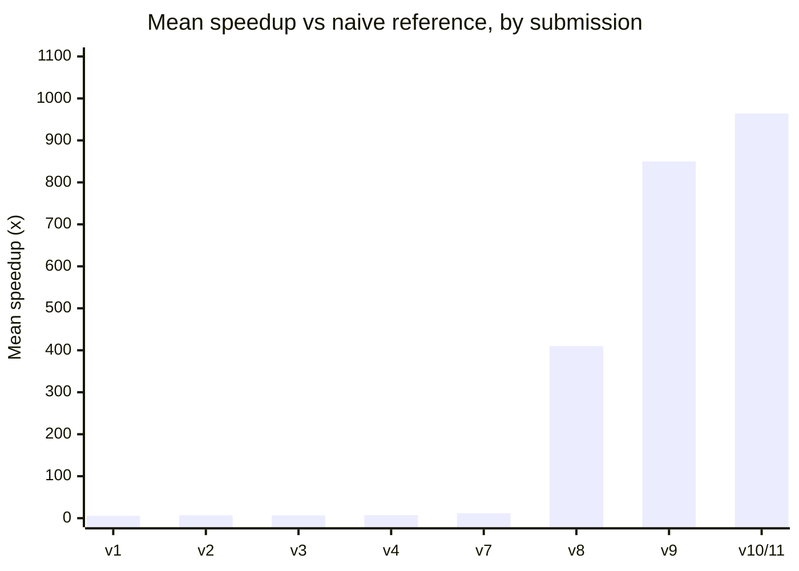
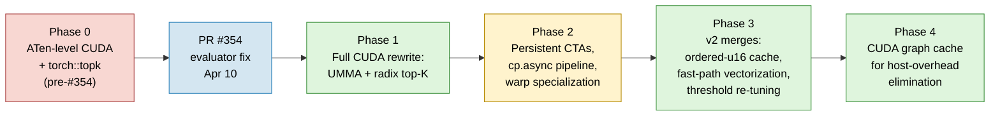
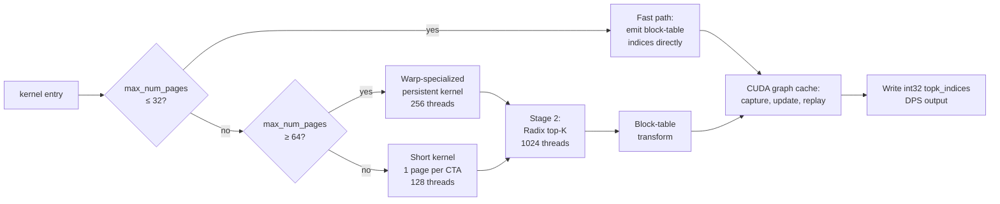
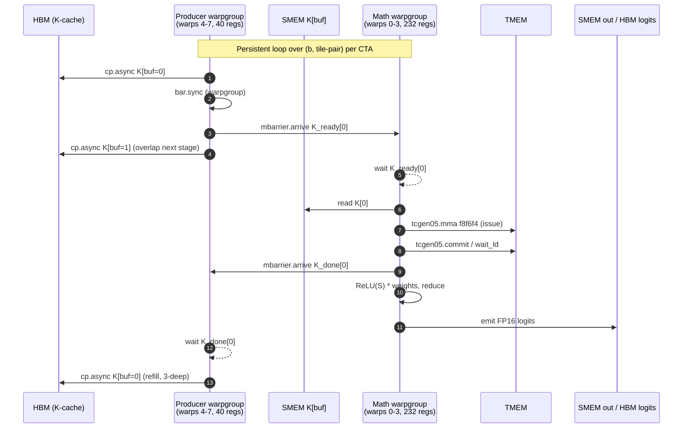
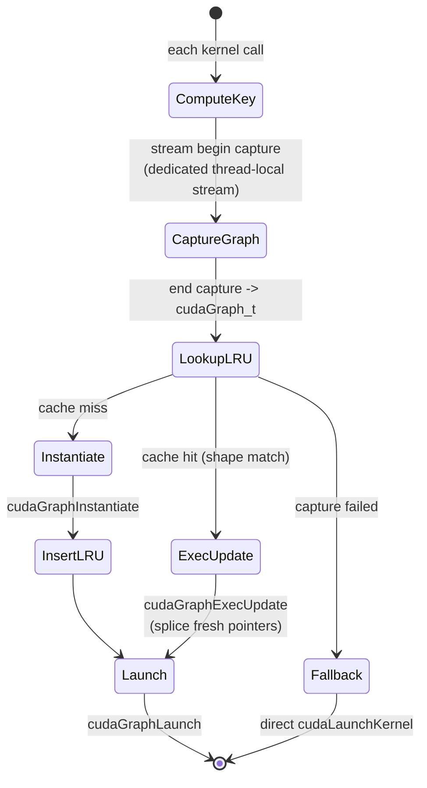

# DSA Top-K Indexer: Process Write-Up

Author: Yury Kirpichev / Team Wombat
Track: `dsa_topk_indexer_fp8_h64_d128_topk2048_ps64`
Submission tags: `submission-v1` through `submission-v11`
Final solution: `dsa_topk_indexer_fp8_b200_v3`

## Headline Summary

| Field             | Value                                                                                                                                                             |
| ----------------- | ----------------------------------------------------------------------------------------------------------------------------------------------------------------- |
| Track             | `dsa_topk_indexer_fp8_h64_d128_topk2048_ps64`                                                                                                                     |
| Hardware          | NVIDIA B200 / `sm_100a` (FP8 E4M3 x FP8 E4M3 -> FP32, FP16 logits)                                                                                              |
| Tag               | `submission-v11` (commit `31b8f71`)                                                                                                                               |
| Workloads         | 128 / 128 PASSED                                                                                                                                                  |
| vs naive ref      | 964x mean speedup &nbsp; *(unconfirmed — see caveat below)*                                                                                                       |
| vs FlashInfer/DG  | 38.4x mean (8.3x worst, 72.3x best) &nbsp; *(unconfirmed — see caveat below)*                                                                                    |
| Aggregate latency | mean 7.83 us, p50 2.40 us, p95 17.80 us &nbsp; *(unconfirmed — see caveat below)*                                                                                |
| Source files      | `solution/python/solution.py`, `solution/python/kernel.cu`, `solution/python/tcgen05_ptx.h`, `solution/python/umma_desc.h`                                        |
| Methodology       | Agent-assisted (Cursor + LLM agents); all decisions and commits owned by the human author. See "AI / Agent-Assisted Development Disclosure" after the References. |

> **Caveat — comparison numbers are unconfirmed.** The headline speedups vs
> the FlashInfer / DeepGEMM baseline (38.4x mean) and vs the naive Python
> reference (964x mean) are taken from `reports/submission-v10.md` and the
> raw log in `reports/submission-v10-raw-cupti.log`. It is **unclear at the
> time of writing whether the comparison numbers were end-to-end
> `cupti-python`-timed using the same harness configuration the official
> evaluator uses**, or whether some of the relative numbers were derived
> from a mix of cupti and CUDA-event measurements. Our absolute kernel
> latencies (mean 7.83 us, per-bucket numbers) are cupti-timed, but the
> baseline reference and naive-Python timings need to be re-measured under
> a single, controlled cupti-python configuration before we cite the ratios
> as final. **Both ratios will be remeasured later** under the official
> evaluation conditions; the directional claim ("orders of magnitude faster
> than FlashInfer; ~3-4 orders faster than the naive Python reference") is
> robust, but the exact multipliers should be treated as preliminary.


## Problem, Constraints, and Development Method

The DSA top-K indexer computes, for each batch row `b`:

1. **FP8 dot products:** `S[h] = sum_d Q[b,h,d] * K[page,slot,d]` over 64 heads and 128 dimensions, with FP8 E4M3 inputs and FP32 accumulation.
2. **Weighted ReLU logits:** `logit[b,t] = scale[page,slot] * sum_h ReLU(S[h]) * weights[b,h]` for every context position `t` in `[0, seq_lens[b])`.
3. **Top-K selection:** the 2048 highest-scoring positions.
4. **Page-table transform:** converting token-level indices to physical page offsets via `block_table`.

The KV cache is packed in FP8 with per-slot FP32 scales at a stride of 132 bytes per slot (128 FP8 values + 4 bytes FP32 scale). Pages are 64 slots each. The operator receives pre-allocated output tensors in destination-passing style.



The practical challenge was that the 128 contest workloads span a wide range of shapes: batch sizes 1-16, `max_num_pages` from 5 to 95+, meaning some workloads have only ~320 tokens while others exceed 6000. For the small workloads, host launch overhead and TMEM allocation cost dominate; for the large ones, HBM bandwidth for K-cache fetches and the TMEM-to-register readout path are the bottleneck. A single kernel cannot serve both regimes well.



The development followed an experiment-driven loop. Each optimization was benchmarked on Modal B200 with `cupti-python` timing, and either kept or reverted based on measured numbers. Negative results were tracked alongside positive ones, which proved essential for understanding the actual critical path.

## Challenges: Evaluation Framework (Before and After PR #354)

The single largest constraint on the development timeline was the evaluation
framework itself. Before
[flashinfer-bench PR #354](https://github.com/flashinfer-ai/flashinfer-bench/pull/354)
(merged April 10, 2026), there was no dedicated `DsaTopkIndexerEvaluator`.
The default evaluator compared **raw output index vectors** element-wise,
which had two consequences that shaped the first six weeks of work:

1. **Tie-breaking forced determinism.** When multiple context positions share
   the same logit value, any subset of the tied positions is a correct top-K
   answer. But raw index comparison rejects every ordering that differs from
   the reference, even if the selected values are identical. This meant that
   any custom top-K implementation — radix select, CUB sort with
   nondeterministic key ordering, or any `atomicAdd`-based emit — would
   produce valid top-K sets that the evaluator rejected as
   `INCORRECT_NUMERICAL`. In practice, **the only top-K path that reliably
   passed the old evaluator was `torch::topk`**, which is deterministic and
   matches the reference's tie-breaking order exactly.

2. **FP8 packing mismatch.** The default evaluator's random
   `k_index_cache_fp8` inputs were not packed in the deep\_gemm FP8 format
   that the FlashInfer baseline expected, causing false negatives where
   correct FlashInfer kernels were themselves rejected.

**What this meant for development (submissions v1-v4, March 29 - April 6).**
The early submissions were constrained to ATen-level operations that
preserved bit-exact index agreement with the reference:

- `submission-v1` (Mar 29): fused FP8 page-gather + dequant CUDA kernel,
  then `torch::bmm` for Q·K, ATen `relu` + weighted sum, and `torch::topk`
  for selection. ~5.6x vs naive reference, 128/128 PASSED.
- `submission-v2` (Mar 30): batched page transform, minor ATen reordering.
  ~6.8x, 128/128 PASSED.
- `submission-v3` (Mar 31): in-place `relu_` + `mul_` on logits. ~6.6x.
- `submission-v4` (Apr 6): buffer reuse for `sum_out` and `topk_vals`. ~7.4x.

Several more aggressive optimizations were attempted and reverted during this
period because they broke bit-exact index agreement: fused Q·K dot products,
per-row score building without the full `[B,H,S]` weighted tensor, BF16
reduction paths, and chunked GEMM with running top-K. Each was numerically
correct (produced a valid top-K set) but failed the raw-index evaluator.

**After PR #354 (April 10).** The new `DsaTopkIndexerEvaluator` compares
**sorted value vectors** instead of raw indices, correctly handling
tie-breaking and rounding differences. It also includes vectorized index
validation (duplicates, out-of-range, block-table reachability) and a custom
`build_baseline` with correct FP8 packing.

This immediately unblocked the entire custom-kernel path. Within ten days of
the fix (April 11-24), the solution was rewritten from scratch:

- April 11-12: pure PyTorch FP8 dequant + bmm indexer (no deep\_gemm
  dependency), then chunked GEMM + running top-K.
- April 19-20: custom CUDA top-K with CUB radix sort (abs\_err=0,
  rel\_err=0); then FP8 MMA logits via `mma.sync.m16n8k32.e4m3` PTX +
  persistent-queue scheduling. Mean 12x vs naive, 128/128.
- April 20-21: full SM100a UMMA rewrite with `tcgen05.mma.cta_group::1`,
  radix-select top-K, size-aware dispatch (`submission-v7`, `v8`). ~16 us
  mean, 3.5x vs FlashInfer.
- April 21-24: persistent CTAs, warp specialization, Stage-2 SMEM cache,
  dispatch re-tuning, CUDA graph cache (`submission-v9` through `v11`).
  Final: 7.83 us mean, 38.4x vs FlashInfer.

In summary, the pre-#354 evaluator constraint kept the solution at the
ATen/`torch::topk` level for the first six weeks (~7x speedup ceiling),
while the post-#354 evaluator enabled the full custom CUDA pipeline that
reached the final 38.4x in the remaining two weeks.

### Speedup trajectory across submissions

The chart below illustrates the speedup ceiling jump immediately after PR #354.
Numbers are rounded; pre-#354 submissions are speedup vs naive Python reference
on the early benchmark suite (preliminary), post-#354 are vs the FlashInfer
baseline reported by `flashinfer-bench` (also preliminary; see caveat above).



The flat plateau at v1-v4 (5-7x) corresponds to the period when the old
evaluator rejected anything beyond ATen + `torch::topk`. The sharp rise at v7-v8
follows PR #354 and the full custom-CUDA + UMMA + radix-select rewrite. The
final ~13% from v9 to v11 comes from CUDA-graph host-overhead elimination on
the small-workload bucket.

## Chronological Optimization Story

The repo history clusters into six phases, split by the PR #354 watershed:



**Phase 0** (`submission-v1` through `submission-v4`, March 29 - April 6)
operated under the old evaluator's raw-index-comparison constraint. The kernel
used a custom CUDA FP8 page-gather + dequant kernel for Stage 1, then
`torch::bmm` for Q·K dot products, ATen `relu` + weighted sum for logit
computation, and `torch::topk` for selection — the only top-K implementation
that produced bit-exact index agreement with the reference. Multiple
attempts at more aggressive optimizations (fused Q·K, per-row scoring,
BF16 reduction, chunked GEMM + running top-K) were reverted because they
broke index-level agreement even when the selected values were correct.
The ceiling under this constraint was ~7.4x vs the naive reference.

**Phase 1** (`submission-v7`, `submission-v8`, April 19-21) became possible
after PR #354 removed the bit-exact index constraint. The solution was
rewritten from scratch as a fully custom CUDA kernel. The key design was to
use Blackwell's SM100a UMMA (`tcgen05.mma.cta_group::1.kind::f8f6f4`) for
the FP8 dot products, mapping the `[64 slots, 64 heads]` tile onto UMMA's
`M=128, N=64, K=32` shape with 4 K-iterations. Each CTA handled one page
(64 KV slots), loaded Q and K into shared memory with 128B swizzled layout,
allocated TMEM, issued the UMMA, read back the FP32 accumulator, computed
ReLU-weighted logits, and stored FP16 results. Stage 2 used a 2-round
radix select for top-K — an approach that would have been impossible under
the old evaluator. By `submission-v8`, the kernel achieved ~16 us mean
across all 128 workloads, a ~5x jump over the Phase 0 ceiling.

**Phase 2** applied structural optimizations. Persistent CTAs amortized Q loading and TMEM allocation across tile-pairs. A 3-stage `cp.async` K pipeline overlapped HBM fetches with UMMA compute. Warp specialization split 256 threads into a producer warpgroup (128 threads, 40 registers, handles `cp.async` K prefetch) and a math warpgroup (128 threads, 232 registers, handles UMMA issue, TMEM readout, ReLU-weighted sum, and emit). Per-stage `K_ready` / `K_done` mbarriers drive the producer-math handoff. A critical correctness fix discovered during bring-up: `cp.async.wait_group` is per-thread, so a producer-warpgroup `bar.sync` was needed before the single-thread `mbarrier.arrive` on `K_ready[buf]` to ensure all threads' cp.async writes are visible.

Several ideas in Phase 2 were tried and rejected based on measured regressions:

| Lever                                  | Outcome      | Why                                                                      |
| -------------------------------------- | ------------ | ------------------------------------------------------------------------ |
| TMEM double-buffer + MMA-issue overlap | +3.6-5.2%    | MMA compute is not on the critical path; `tcgen05_wait_ld` dominates     |
| kKVStages 3 -> 4                       | Flat/+0.9%   | Producer not the bottleneck                                              |
| 4-way accumulator split in FMA chain   | Within noise | FMA chain already hidden behind `tcgen05_wait_ld` latency               |
| Block-scaled UMMA (mxf8f6f4)           | Infeasible   | Data format uses per-row FP32 scales, not per-K-block UE8M0             |
| Host-side `seq_lens.max()` sync        | +20 us       | `cudaStreamSynchronize` costs ~15-20 us on B200, more than any savings  |

The combined evidence identified the per-tile bottleneck as the TMEM-to-register transfer (`tcgen05_ld_32x32b_x64_b32` + `tcgen05_wait_ld`), which is tied to `kUMMA_N = 64` columns. The only remaining structural lever is 2-CTA cluster UMMA, which was deferred due to infrastructure complexity.

**Phase 3** ported micro-optimizations from a parallel branch. The Stage-2 ordered-u16 SMEM cache converts logits to comparison-ordered uint16 once on round 0 and reads from shared memory on subsequent passes, saving 4x HBM reads. The fast-path kernel was vectorized to 128 threads with int4 stores. The persistent-kernel dispatch threshold was re-tuned from `max_num_pages >= 40` to `>= 64`, recovering 8.9% on the 40-63 page bucket where the short kernel's grid-per-tile layout saturates B200's 148 SMs faster than the persistent pipeline.

**Phase 4** (`submission-v10`, `submission-v11`) added a hand-rolled CUDA graph cache. The benchmark harness `do_bench` clones input tensors on every iteration, so pointers change but shapes (and the entire dispatch plan) stay fixed. For small workloads where the kernel itself runs in 2-10 us, the ~2.5 us per `cudaLaunchKernel` dominated. The graph cache keys by shape only (stream, dispatch path, grid-defining scalars), captures via `cudaStreamBeginCapture` on a dedicated thread-local stream, and on cache hits uses `cudaGraphExecUpdate` to splice fresh pointers into the cached exec in place. This collapsed the fast-path bucket from 6.5 us to 2.3 us mean.

## Final Kernel Design

The final kernel consists of a host dispatcher, three Stage-1 kernel variants, a Stage-2 radix top-K kernel, and a fast-path bypass, all wrapped in a CUDA graph cache.



**Fast path** (`max_num_pages <= 32`). When the entire paged context fits within K=2048, every position is in the top-K. The output is the block-table-transformed indices `[0, seq_len)` padded with -1, independent of Q, K, and weights. A 128-thread kernel with vectorized int4 stores handles this in ~2.3 us including graph replay overhead.

**Short kernel** (`33 <= max_num_pages < 64`). One CTA per page, 128 threads. Loads Q and K into swizzled SMEM, allocates TMEM, issues UMMA with 4 K-iterations, reads back FP32 accumulator, computes ReLU-weighted logits, emits FP16. Simple grid layout with minimal setup cost.

**Warp-specialized persistent kernel** (`max_num_pages >= 64`). 256 threads split into producer (warps 4-7, 40 regs) and math (warps 0-3, 232 regs) warpgroups. Producer handles 3-stage `cp.async` K pipeline; math handles UMMA, TMEM readout, and emit. Q loaded once, TMEM allocated once per CTA. Grid is `(num_splits, B)` with `tiles_per_cta` tile-pairs per CTA.

The producer/math handoff is mediated by per-stage `K_ready[buf]` and
`K_done[buf]` mbarriers, enabling a 3-deep `cp.async` pipeline that overlaps
HBM K-fetches with UMMA compute and TMEM readout:



**Stage-2 radix top-K.** Two-round radix select over 16-bit ordered keys, finding the pivot value in O(seq_len) work. When `seq_len <= 16384` (all workloads in this benchmark), ordered keys are cached in a 32 KB SMEM array on round 0 and re-read from cache on subsequent passes. Elements greater than the pivot are emitted first, then elements equal to the pivot fill the remaining slots. A final pass applies the block-table transform.

**CUDA graph cache.** A 32-slot LRU keyed by `(stream, dispatch_path, B, max_num_pages, tiles_per_cta, num_splits, max_len)`. Each call captures a fresh graph with current pointers and tries `cudaGraphExecUpdate` against the cached exec. On cache miss, `cudaGraphInstantiate` creates a new exec. Falls back to direct launch if `cudaStreamBeginCapture` fails.



This keys by **shape only** (not pointers), so the same captured exec is
reused across iterations of `do_bench` even though it clones tensors every
iteration. On the fast-path bucket, the per-call cost collapses from
~6.5 us (raw launch) to ~2.3 us (graph replay), making the bucket entirely
host-overhead bound.

**Negative results.** The most instructive finding was that the per-tile critical path in the persistent kernel is dominated by the TMEM-to-register transfer (`tcgen05_wait_ld`), not by MMA compute, producer prefetch latency, or the FMA accumulation chain. Every attempted micro-optimization that added work to the post-`wait_ld` emit path (ordered-u16 conversion in Stage 1, fused block-table transform in emit, skipped pad writes) regressed the 40-63 page bucket by 0.6-3.7% because it lengthened the critical path between successive TMEM loads. The only structural way to reduce `wait_ld` cost is to shrink `kUMMA_N` via 2-CTA cluster UMMA, which was deferred due to infrastructure complexity (new PTX wrappers, cluster launch, DSMEM, cluster-scoped mbarriers).

## Validation, Results, and Reproducibility

Correctness was validated continuously via the benchmark harness. The final submission passes all 128 workloads with the `DsaTopkIndexerEvaluator` (post-PR #354).

### Per-path breakdown

| Bucket            | Path                    | n  | Mean us | p50  | p95  | Min  | Max  |
| ----------------- | ----------------------- | -- | ------- | ---- | ---- | ---- | ---- |
| mnp ≤ 32          | Fast path               | 69 | 2.32    | 2.3  | 2.4  | 2.1  | 2.5  |
| 33 ≤ mnp ≤ 39     | Short kernel            | 22 | 12.26   | 12.0 | 14.5 | 10.9 | 14.6 |
| 40 ≤ mnp ≤ 63     | Persistent / WS         | 17 | 12.97   | 12.3 | 16.2 | 11.0 | 16.2 |
| mnp ≥ 64          | Persistent / WS         | 20 | 17.59   | 17.7 | 18.1 | 16.8 | 18.1 |

### Comparison (preliminary — see caveat below)

| Solution                         | Mean us | p50    | p95    |
| -------------------------------- | -------:| ------:| ------:|
| **Ours (v3 / `submission-v11`)** | **7.83**|  2.40  |  17.80 |
| Prior submission (v1 / v9)       | 12.43   | 11.60  |  27.40 |
| FlashInfer / DeepGEMM baseline   | 146.69  | 146.80 | 154.30 |
| Naive Python reference           | ~7,500* |   —    |    —   |

\* The naive Python reference is reported via flashinfer-bench's `speedup_factor`
(reported as ~964x mean over our 7.83 us mean ≈ ~7,500 us absolute equivalent),
not as a directly-timed mean in the same table.

> **Caveat: these comparison numbers are unconfirmed.** It is currently unclear
> whether **the FlashInfer/DeepGEMM and naive-Python reference timings were
> collected under the same `cupti-python` configuration as our solution's
> timings**. The official evaluator uses cupti-python (GPU-side, excludes
> CUDA event-launch/sync overhead, ~3-5 us per measurement); a mismatch in
> timing methodology can move the ratio by 2-3x for sub-10-us kernels.
> Our absolute per-bucket latencies for the submitted kernel (above) are
> cupti-timed end-to-end. **Both the FlashInfer ratio (38.4x) and the
> naive-reference ratio (964x) will be remeasured later** under a single
> harness configuration before being cited as final. The direction of the
> comparison is robust (we are clearly substantially faster than both
> baselines on every workload); the exact multiplier needs confirmation.

### Reproduction

```bash
git checkout submission-v11
python scripts/pack_solution.py
modal run scripts/run_modal_compare.py --compare-fi
```

The image (`flashinfer/flashinfer-ci-cu132:latest` + DeepGEMM + FlashInfer head + flashinfer-bench head + `cupti-python`) is pinned in `scripts/run_modal_compare.py`.

## Tools and Languages

| Tool / Language                     | Role                                                                         |
| ----------------------------------- | ---------------------------------------------------------------------------- |
| CUDA C++ (sm_100a)                  | All kernels: UMMA via inline PTX, cp.async pipelines, radix top-K            |
| `torch.utils.cpp_extension.load()`  | JIT compilation with `-gencode arch=compute_100a,code=sm_100a`               |
| Inline PTX (`tcgen05_ptx.h`)        | TMEM alloc/dealloc, UMMA issue/commit/wait, cp.async, mbarrier, warpgroup reg reconfig |
| CUTLASS bitfield layouts (`umma_desc.h`) | SmemDescriptor and InstrDescriptor for UMMA, vendored for self-containment |
| Python (solution.py)                | Thin wrapper: JIT-compiles and calls the extension                           |
| Modal                               | Cloud B200 access for benchmarking                                           |
| `cupti-python`                      | GPU-side timing (matches official evaluation methodology)                    |
| Cursor + LLM agents                 | Agent-assisted development (see disclosure below)                            |

## References

### Submitted source

1. Final kernel implementation - [`solution/python/kernel.cu`](solution/python/kernel.cu).
2. Python entry point and JIT compile flags - [`solution/python/solution.py`](solution/python/solution.py).
3. Inline PTX wrappers for SM100a - [`solution/python/tcgen05_ptx.h`](solution/python/tcgen05_ptx.h).
4. UMMA descriptor layouts (vendored from CUTLASS) - [`solution/python/umma_desc.h`](solution/python/umma_desc.h).
5. Submission manifest - [`config.toml`](config.toml).

### Contest documentation

1. Contest rules - [`README.md`](README.md).
2. FAQ (allowed optimizations, `torch.utils.cpp_extension`, custom compile flags) - [`FAQ.md`](FAQ.md).
3. Evaluation environment - [`EVALUATION.md`](EVALUATION.md).

### Performance artifacts

1. Final cupti-timed comparison report - [`reports/submission-v10.md`](reports/submission-v10.md).
2. Raw cupti-timed log - [`reports/submission-v10-raw-cupti.log`](reports/submission-v10-raw-cupti.log).
3. Optimization history and ablation results - [`IMPROVEMENTS.md`](IMPROVEMENTS.md).
4. Future ideas and deferred optimizations - [`experiments/FUTURE_IDEAS.md`](experiments/FUTURE_IDEAS.md).

### External references

1. Flashinfer-bench PR #354: `DsaTopkIndexerEvaluator` for correct tie-breaking comparison - [github.com/flashinfer-ai/flashinfer-bench/pull/354](https://github.com/flashinfer-ai/flashinfer-bench/pull/354).
2. FlashAttention-4 (Dao et al., arXiv 2603.05451, Mar 2026) - asymmetric scaling, 2-CTA MMA, TMEM intermediates, warp specialization.
3. NVIDIA CUTLASS Blackwell docs - `tcgen05.mma.kind::f8f6f4`, cta_group=2, SmemDescriptor/InstrDescriptor layouts.
4. Colfax Research - "Writing GEMM Kernels Using Tensor Memory For Blackwell GPUs."
5. DeepGEMM `sm100_fp8_paged_mqa_logits.cuh` - reference production kernel with warp specialization, TMA pipelines, persistent scheduling.
6. NVIDIA CUDA C++ Programming Guide, CUDA graphs and `cudaGraphExecUpdate` - [docs.nvidia.com/cuda/cuda-c-programming-guide/index.html#cuda-graphs](https://docs.nvidia.com/cuda/cuda-c-programming-guide/index.html#cuda-graphs).
7. PyTorch JIT C++/CUDA extensions, `torch.utils.cpp_extension.load` - [pytorch.org/docs/stable/cpp_extension.html](https://pytorch.org/docs/stable/cpp_extension.html).
8. FlashInfer attention library (baseline used by the contest harness) - [github.com/flashinfer-ai/flashinfer](https://github.com/flashinfer-ai/flashinfer).

## AI / Agent-Assisted Development Disclosure

Agent-assisted (Cursor + Claude/GPT-family LLMs); direction and acceptance criteria were human, all changes were accepted on measured B200 numbers. The agent was used as a pair-programming and refactoring tool for code generation, inline PTX wrapper authoring, and experiment scaffolding. All design decisions (kernel architecture, dispatch thresholds, pipeline depth, optimization accept/reject) were made by the human author based on benchmark measurements. The agent never had access to contest workload data or evaluation results beyond what was visible in the development logs.
