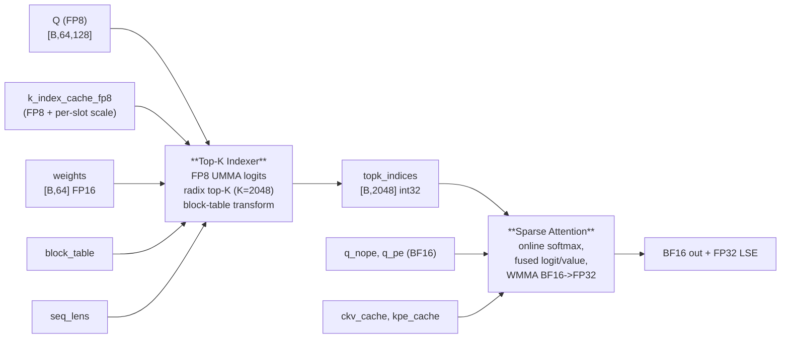
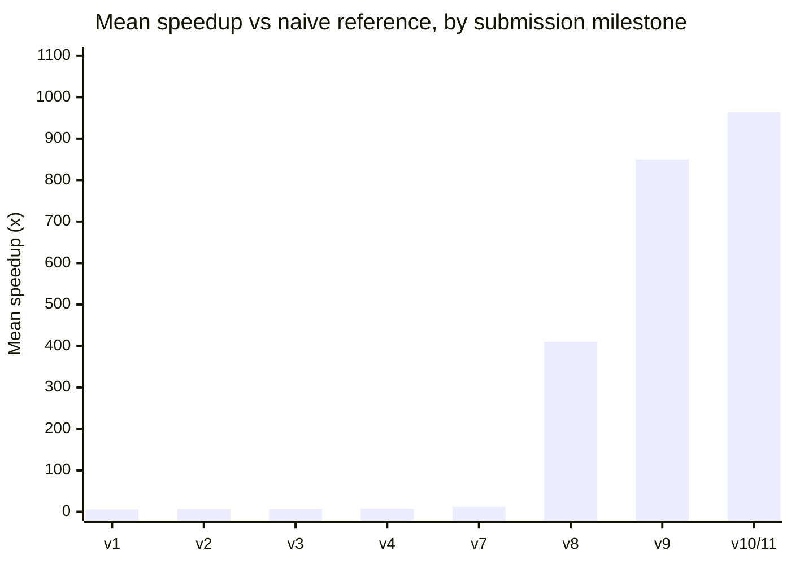
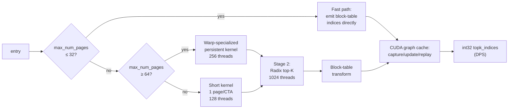
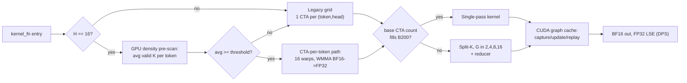
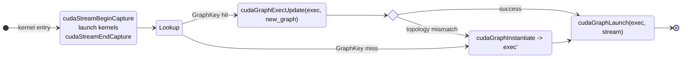

# DSA Track: Joint Process Write-Up (Top-K Indexer + Sparse Attention)

Author: Yury Kirpichev / Team Wombat
Tracks:
- `dsa_topk_indexer_fp8_h64_d128_topk2048_ps64` (final solution `dsa_topk_indexer_fp8_b200_v3`, commit `31b8f71`)
- `dsa_sparse_attention_h16_ckv512_kpe64_topk2048_ps64` (final solution `wombat_dsa_sparse_mla_sm100a_final`, tag `submission-final-v2`, commit `de475b9`)

Hardware (both): NVIDIA B200 / `sm_100a`. Methodology (both): experiment-driven, agent-assisted (Cursor + Claude/GPT-family LLMs); all design decisions accepted on measured B200 numbers.

## Headline Summary

**Official contest evaluation (DSA track, agent-assisted):** all workloads passed — Top-K indexer **128 / 128**, sparse attention **23 / 23**. Average speedup vs. `flashinfer_wrapper_5af199` + `flashinfer_deepgemm_wrapper_2ba145`: **28.96×** (track-level aggregate on the contest harness).

The table below reports development benchmarks collected on Modal B200 with `cupti-python` (warmup 3, iterations 100, 5 trials), aligned with the official evaluation methodology.

| Field             | Top-K Indexer (FP8)                                            | Sparse Attention (BF16)                                |
| ----------------- | -------------------------------------------------------------- | ------------------------------------------------------ |
| Datatype          | FP8 E4M3 x FP8 E4M3 -> FP32, FP16 logits                       | BF16 in/out, FP32 LSE and split-K partials             |
| Workloads         | 128 / 128 PASSED                                               | 23 / 23 PASSED, `abs_err <= 1.56e-2`                   |
| vs naive / PyTorch ref | 964× mean                                                | 126.03×                                                |
| vs FlashInfer/DG  | 38.4× mean (8.3× worst, 72.3× best)                           | 14.18×                                                 |
| Aggregate latency | mean 7.83 μs, p50 2.40 μs, p95 17.80 μs                        | 0.719 ms total (vs 6.793 ms FlashInfer, 66.079 ms ref) |
| Source files      | `solution/python/{solution.py,kernel.cu,tcgen05_ptx.h,umma_desc.h}` | `solution/python/{solution.py,kernel.cu}`          |

## DSA Pipeline and Joint Problem Setting

The two operators form one half of a DSA decoding step on B200: the **Top-K Indexer** scores every paged KV position against the current query and emits the `K=2048` most relevant token indices; the **Sparse Attention** kernel then reads only those `2048` positions out of a compressed MLA KV cache and produces BF16 output + FP32 LSE in destination-passing style.

The 128 (indexer) and 23 (attention) contest workloads each span small to mid-range shapes where launch overhead, occupancy, memory scheduling, and sparse-index density are at least as important as raw arithmetic throughput. A single-kernel design cannot serve both small and large regimes well — both submissions ended up as **size/density-aware host dispatchers** over a small set of specialized kernels, with a CUDA-graph cache wrapping the launch sequence.

## Shared Development Method

Each optimization was introduced on a branch or phase, benchmarked on Modal B200 with `cupti-python` matching the official harness, and either kept, refined, or reverted on measured numbers. This produced a history with substantial **negative results** that constrained the final designs as much as the positive ones: head tiling, deeper value/K prefetch, full warp specialization, BF16 logit storage, TMA gather, and large-N Blackwell UMMA were all tried in the attention kernel and reverted; in-Stage-1 ordered-u16 conversion, fused block-table transform in the emit path, kKVStages 3->4, and a TMEM double-buffer + MMA-overlap scheme were tried in the indexer and reverted. Documenting why these were rejected was an explicit goal of both write-ups.

Development was **agent-assisted**: Cursor with Claude/GPT-family LLMs was used as a pair-programming and refactoring tool; all benchmarks, correctness checks, and commit decisions were owned by the human author and accepted only when measured B200 numbers improved. The agent never had access to contest workload data or evaluator outputs beyond what appeared in development logs.

## Kernel A — Top-K Indexer (FP8, H=64, D=128, K=2048)

**Problem.** For each batch row `b`, compute FP8 dot products `S[h] = sum_d Q[b,h,d] * K[page,slot,d]` over 64 heads / 128 dims with FP32 accumulation, weighted ReLU logits `logit[b,t] = scale[page,slot] * sum_h ReLU(S[h]) * weights[b,h]` for every position in `[0, seq_lens[b])`, top-K = 2048 selection, and a `block_table` transform back to physical page slots. The KV cache is FP8 with per-slot FP32 scales (132 bytes/slot, 64 slots/page); outputs are pre-allocated (DPS).

### The evaluator pre/post-#354 was the dominant constraint

The single largest constraint on the timeline was the evaluator. Before [flashinfer-bench PR #354](https://github.com/flashinfer-ai/flashinfer-bench/pull/354) (merged Apr 10, 2026) there was no dedicated `DsaTopkIndexerEvaluator`. The default evaluator compared **raw output index vectors** element-wise, with two consequences: (1) when multiple positions tie on logit value any custom top-K — radix select, CUB sort, atomic emit — produced a valid top-K set that the evaluator rejected as `INCORRECT_NUMERICAL` because the index ordering did not match the reference's tie-breaking; and (2) the evaluator's random `k_index_cache_fp8` inputs were not packed in the deepgemm FP8 format the FlashInfer baseline expected, causing false negatives against FlashInfer itself. In practice the only top-K path that reliably passed was `torch::topk`.

**Pre-#354 (v1-v4, Mar 29 - Apr 6, ceiling ~7x).** The early kernel was constrained to ATen ops that preserved bit-exact index agreement: a fused FP8 page-gather + dequant CUDA kernel, then `torch::bmm` for Q·K, ATen `relu` + weighted sum, and `torch::topk`. Several aggressive ideas were tried and reverted because they broke index-level agreement even when the selected values were correct: fused Q·K dot products, per-row scoring, BF16 reduction, chunked GEMM with running top-K.

**Post-#354 (Apr 11 onward).** PR #354 introduced `DsaTopkIndexerEvaluator` which compares **sorted value vectors**, vectorizes index validation (duplicates, out-of-range, block-table reachability), and provides a `build_baseline` with correct FP8 packing. Within ten days the solution was rewritten from scratch: pure PyTorch FP8 dequant + bmm indexer (Apr 11-12), then custom CUDA top-K with CUB radix sort and FP8 MMA logits via `mma.sync.m16n8k32.e4m3` PTX (Apr 19-20), then a full SM100a UMMA rewrite with `tcgen05.mma.cta_group::1`, radix-select top-K, and size-aware dispatch (`v7`, `v8`, ~16 us mean), then persistent CTAs, warp specialization, Stage-2 SMEM cache, dispatch retuning and a CUDA graph cache (`v9`-`v11`). The final 7.83 us mean / 38.4x vs FlashInfer was reached on Apr 24.

The flat plateau at v1-v4 corresponds to the period when the old evaluator capped progress; the sharp rise at v7-v8 follows PR #354 and the full custom-CUDA + UMMA + radix-select rewrite; the final ~13% from v9 to v11 comes from CUDA-graph host-overhead elimination on the small-workload bucket.

### Final indexer design

A host dispatcher selects between three Stage-1 variants plus a fast-path bypass; Stage-2 is a radix top-K; a hand-rolled CUDA graph cache wraps the whole launch sequence.

**Fast path** (`max_num_pages <= 32`). When the entire paged context fits within K=2048 every position is in the top-K, so the output is just a block-table-transformed `[0, seq_len)` padded with -1, independent of Q, K, weights. 128 threads with vectorized int4 stores, ~2.3 us including graph replay overhead.

**Short kernel** (`33 <= max_num_pages < 64`). One CTA per page, 128 threads. Q and K loaded into 128B-swizzled SMEM, TMEM allocated, UMMA issued with 4 K-iterations on `(M=128, N=64, K=32)`, FP32 accumulator read back, ReLU-weighted logits computed, FP16 emitted.

**Warp-specialized persistent kernel** (`max_num_pages >= 64`). 256 threads = producer warpgroup (warps 4-7, 40 regs, 3-stage `cp.async` K pipeline) and math warpgroup (warps 0-3, 232 regs, issues UMMA, reads TMEM, computes ReLU/weighted sum, emits). Q is loaded once and TMEM allocated once per CTA. Per-stage `K_ready[buf]`/`K_done[buf]` mbarriers drive the handoff. A subtle bring-up bug: `cp.async.wait_group` is per-thread, so a producer-warpgroup `bar.sync` is required before the single-thread `mbarrier.arrive` on `K_ready[buf]` to ensure all threads' cp.async writes are visible.

**Stage-2 radix top-K.** Two-round radix select over 16-bit ordered keys finds the pivot in O(seq_len). Since `seq_len <= 16384` for all benchmarked workloads, ordered keys are cached in a 32 KB SMEM array on round 0 and re-read on subsequent passes (4x fewer HBM reads). Elements > pivot emit first, equal-to-pivot fills remaining slots, then the block-table transform runs.

### Critical-path finding (negative result)

The most useful single finding was that the per-tile critical path in the persistent kernel is **dominated by the TMEM-to-register transfer** (`tcgen05_ld_32x32b_x64_b32` + `tcgen05_wait_ld`), not by MMA compute, producer-prefetch latency, or the FMA accumulation chain. Levers that were measured and rejected: TMEM double-buffer + MMA-issue overlap (+3.6-5.2%, MMA not on critical path); kKVStages 3 -> 4 (flat); 4-way accumulator split (within noise); block-scaled UMMA `mxf8f6f4` (infeasible — per-row FP32 scales, not per-K-block UE8M0); host-side `seq_lens.max()` sync (+20 us). Every micro-optimization that added work to the post-`wait_ld` emit path regressed the 40-63 page bucket by 0.6-3.7% by lengthening the critical path between successive TMEM loads. The only structural way to reduce `wait_ld` cost is to shrink `kUMMA_N` via 2-CTA cluster UMMA, deferred due to infrastructure complexity (PTX wrappers, cluster launch, DSMEM, cluster-scoped mbarriers). What did stick in Phase 3: Stage-2 ordered-u16 SMEM cache, int4-vectorized fast-path stores, and re-tuning the persistent dispatch threshold from `>= 40` to `>= 64` (recovers 8.9% on the 40-63 page bucket where the short kernel saturates B200's 148 SMs faster than the persistent pipeline).

## Kernel B — Sparse Attention (BF16, H=16, ckv=512, kpe=64, K=2048)

**Problem.** The operator receives per-token query tensors `q_nope` and `q_pe`, compressed KV caches `ckv_cache` and `kpe_cache`, and `TOPK=2048` sparse indices. It writes a BF16 output tensor and FP32 log-sum-exp tensor in destination-passing style. The practical challenge was not arithmetic intensity but the workload distribution: many shapes are small enough that launch overhead, occupancy, and sparse-index density dominate raw throughput.

### Optimization story (eight phases)

```mermaid
flowchart LR
    P0[Phase 0<br/>Baselines and<br/>Modal harness]
    P1[Phase 1<br/>CUDA stages 1-3:<br/>cp.async, fused softmax]
    P2[Phase 2<br/>Negative: head tiling,<br/>V_PIPE, bf16 logits]
    P3[Phase 3<br/>Split-K G in<br/>1,2,4,8,16]
    P4[Phase 4<br/>sm_100a, TMA,<br/>warp-spec experiments]
    P5[Phase 5<br/>CTA-per-token<br/>WMMA path]
    P6[Phase 6<br/>FP32 split-K partials<br/>+ density gate]
    P7[Phase 7<br/>Torch JIT packaging<br/>+ CUDA graph cache]
    P0 --> P1 --> P2 --> P3 --> P4 --> P5 --> P6 --> P7
    classDef kept fill:#dff5dd,stroke:#3a8f3a,color:#000
    classDef rejected fill:#f8d7d2,stroke:#a44,color:#000
    class P0,P1,P3,P5,P6,P7 kept
    class P2,P4 rejected
```

Three principles survived to the final solution: **(1) Reduce repeated HBM traffic** — `v5_fused` collapsed logit, softmax, and value accumulation into a single-pass online-softmax K loop that consumes each sparse KV tile exactly once. **(2) BF16 only at the output boundary** — intermediate logits / split-K partials in BF16 caused intermittent `abs_err` spikes; the final split-K path uses FP32 partial buffers and converts to BF16 only on the final write. **(3) Treat workloads as shape/density families, not one regime** — three correct paths plus a GPU-side density gate.

### Final attention design

**Legacy kernel.** One CTA per `(token, head)`. Sparse indices are prescanned with vectorized `int4` loads; invalid entries are canonicalized to `-1` and zero-filled in shared memory rather than fetched. The K loop is fused (load tile -> logits -> online softmax update -> value accumulate), keeping memory traffic close to one use per tile and never materializing a full `TOPK` logit array.

**Split-K.** For grids that underfill B200, a split factor `G in {2,4,8,16}` runs `G` partial kernels emitting FP32 partial output, max, and normalizer buffers; a reducer combines the `G` online-softmax states with the same max/sum rescaling identity and writes BF16 + FP32 LSE.

**CTA-per-token (`H=16`).** One CTA per token, one warp per head, with WMMA BF16xBF16 to FP32 on both logit and value-accumulation steps. This converts the 16-head batch into tensor-core-shaped work while keeping online-softmax state per head. MMA scratch and output scratch share SMEM overlays because their lifetimes are disjoint. This was the main late-stage win over the scalar per-head path.

**Density pre-scan.** A GPU pre-scan counts valid sparse-index entries and routes high-density shapes to the CTA-per-token path; low-density shapes (e.g. `385742b2`, `4c46a94b`) fall back to the legacy grid, avoiding the fixed CTA-per-token floor.

### Negative results

Blackwell `tcgen05.mma`/UMMA expected far larger N than the skinny-GEMM-shaped value accumulation here provides; full warp specialization was correct but issue-slot limited; TMA/gather variants and deeper pipelines lost to the simpler `cp.async` path. The final design is deliberately not "use every Blackwell feature." This is the **opposite** finding to the indexer, where UMMA was the right tool — the contrast is structural: the indexer's Stage-1 has a square-ish `(M=128, N=64, K=32)` shape that maps cleanly to UMMA, while the attention's value accumulation is a skinny GEMM along a small head dimension where UMMA's overhead dominates.

## Cross-cutting: shared CUDA graph cache pattern

Both kernels use the same hand-rolled in-extension graph cache. `do_bench` clones inputs every iteration so pointers change but shapes (and dispatch plan) stay fixed; for small workloads where the kernel itself is single-digit microseconds, ~2.5 us per `cudaLaunchKernel` dominated. The cache is keyed by `(stream, dispatch_path, shape, scale_bits, split_factor, ...)` (no tensor pointers). Each call captures a fresh graph with current pointers and tries `cudaGraphExecUpdate` against the cached exec; on topology mismatch the entry is re-instantiated. Falls back to direct launch if `cudaStreamBeginCapture` fails. In the indexer this collapsed the fast-path bucket from 6.5 μs to 2.3 μs mean.

## Official evaluation and development benchmarks

Correctness matches the contest harness: all **128** indexer workloads pass the post-#354 `DsaTopkIndexerEvaluator`; all **23** attention workloads pass with `abs_err <= 1.56e-2`. The **28.96×** track-average speedup and pass/fail outcomes above are from official evaluation against `flashinfer_wrapper_5af199` and `flashinfer_deepgemm_wrapper_2ba145`.

Headline table timings and per-kernel speedups were measured on Modal B200 with the comparison harness configured for `cupti-python` (warmup 3, iterations 100, 5 trials).

For the attention kernel, the **isolated speedup of the in-kernel CUDA graph cache** was not measured in a single controlled A/B: one available comparison mixed `cupti-python` timings with an older CUDA-event-timed run with graphs disabled, so the report does not state a separate graph-cache-only figure.

### Sparse attention — post-deadline improvements

#### Routing problem

The sparse attention wrapper chooses between a legacy grid (one CTA per token and head) and a faster CTA-per-token WMMA path when `H = 16`. At small batch sizes, a naive implementation pays for a density pre-scan and a host round-trip every call, which can dominate end-to-end time.

#### What shipped (`submission-final-v2`)

The router runs a small GPU pre-scan that counts valid sparse-index entries, copies the result with `cudaMemcpyAsync(device→host)` and `cudaStreamSynchronize`, and compares average density to a threshold. A compact host-side `DensityCache` (32 entries), keyed by `(sparse_indices.data_ptr(), T, num_kv_rows)`, reuses the last count when inputs are stable so steady-state calls avoid repeating the sync. The two GPU paths are mathematically the same operator; both satisfy the public correctness suite.

#### The cache is optional — the win is in the routing

A post-deadline B200 study ([six configurations, per-workload tables](https://github.com/ykirpichev/dsa_sparse_attention_h16_ckv512_kpe64_topk2048_ps64/blob/reports/submission-final-v2-draft/artifacts/density_cache_vs_shape_dispatch/REPORT.md)) compared:

| Variant | Role | Mean speedup vs common reference (23 workloads) |
| ------- | ---- | ------------------------------------------------- |
| Density cache on | Matches the submission’s steady-state behavior | 156× |
| Density cache off | Pre-scan + sync on every call | 51× |
| Shape-only rule | `T ≥ 8` → CTA-per-token when `H` matches the optimized path; else legacy — no cache, no sync | 157× |

The shape rule is sync-free and slightly faster than the cached path because it avoids two `T = 6` cases (`ddfa9e34`, `d57eb9e1`) where the `density_avg ≥ 210` threshold picked the slower branch.

#### Takeaway for downstream code

Performance comes from picking the right kernel for the shape, not from retaining `DensityCache`. A practical revision is to remove the cache (~150 LoC) and use a one-line predicate such as `if (H == CPT_H && T >= 8) → CTA-per-token`, preserving or improving latency without per-call synchronization or dependence on pointer-stable allocator behavior. The artifact report linked above documents the full methodology and numbers.

In summary, the joint submission combines, on both kernels, memory-traffic reduction, fused critical loops (online softmax in attention; UMMA + radix-select pivot in the indexer), shape/density-aware host dispatch, and CUDA graph replay for launch overhead. Both are self-contained (`solution.py` + `kernel.cu` (+ PTX/UMMA headers in the indexer)), JIT-compiled via `torch.utils.cpp_extension.load` with `-gencode arch=compute_100a,code=sm_100a`. Both pass all public workloads.

## References

### Submitted source (Top-K Indexer) — pinned to `submission-v11` (commit `31b8f71`) of [`ykirpichev/dsa_topk_indexer_fp8_h64_d128_topk2048_ps64`](https://github.com/ykirpichev/dsa_topk_indexer_fp8_h64_d128_topk2048_ps64)

1. Final kernel implementation - [solution/python/kernel.cu](https://github.com/ykirpichev/dsa_topk_indexer_fp8_h64_d128_topk2048_ps64/blob/submission-v11/solution/python/kernel.cu).
2. Python entry point and JIT compile flags - [solution/python/solution.py](https://github.com/ykirpichev/dsa_topk_indexer_fp8_h64_d128_topk2048_ps64/blob/submission-v11/solution/python/solution.py).
3. Inline PTX wrappers for SM100a - [solution/python/tcgen05_ptx.h](https://github.com/ykirpichev/dsa_topk_indexer_fp8_h64_d128_topk2048_ps64/blob/submission-v11/solution/python/tcgen05_ptx.h).
4. UMMA descriptor layouts (vendored from CUTLASS) - [solution/python/umma_desc.h](https://github.com/ykirpichev/dsa_topk_indexer_fp8_h64_d128_topk2048_ps64/blob/submission-v11/solution/python/umma_desc.h).
5. Submission manifest - [config.toml](https://github.com/ykirpichev/dsa_topk_indexer_fp8_h64_d128_topk2048_ps64/blob/submission-v11/config.toml).

### Submitted source (Sparse Attention) — pinned to `submission-final-v2` (commit `de475b9`) of [`ykirpichev/dsa_sparse_attention_h16_ckv512_kpe64_topk2048_ps64`](https://github.com/ykirpichev/dsa_sparse_attention_h16_ckv512_kpe64_topk2048_ps64)

1. Final kernel implementation - [solution/python/kernel.cu](https://github.com/ykirpichev/dsa_sparse_attention_h16_ckv512_kpe64_topk2048_ps64/blob/submission-final-v2/solution/python/kernel.cu).
2. Python entry point and JIT compile flags - [solution/python/solution.py](https://github.com/ykirpichev/dsa_sparse_attention_h16_ckv512_kpe64_topk2048_ps64/blob/submission-final-v2/solution/python/solution.py).
3. Submission manifest - [config.toml](https://github.com/ykirpichev/dsa_sparse_attention_h16_ckv512_kpe64_topk2048_ps64/blob/submission-final-v2/config.toml).

### Contest documentation

1. Top-K indexer track docs - [README.md](https://github.com/ykirpichev/dsa_topk_indexer_fp8_h64_d128_topk2048_ps64/blob/submission-v11/README.md), [FAQ.md](https://github.com/ykirpichev/dsa_topk_indexer_fp8_h64_d128_topk2048_ps64/blob/submission-v11/FAQ.md), [EVALUATION.md](https://github.com/ykirpichev/dsa_topk_indexer_fp8_h64_d128_topk2048_ps64/blob/submission-v11/EVALUATION.md).
2. Sparse attention track docs - [README.md](https://github.com/ykirpichev/dsa_sparse_attention_h16_ckv512_kpe64_topk2048_ps64/blob/submission-final-v2/README.md), [FAQ.md](https://github.com/ykirpichev/dsa_sparse_attention_h16_ckv512_kpe64_topk2048_ps64/blob/submission-final-v2/FAQ.md), [EVALUATION.md](https://github.com/ykirpichev/dsa_sparse_attention_h16_ckv512_kpe64_topk2048_ps64/blob/submission-final-v2/EVALUATION.md), [SUBMISSION.md](https://github.com/ykirpichev/dsa_sparse_attention_h16_ckv512_kpe64_topk2048_ps64/blob/submission-final-v2/SUBMISSION.md).

### Performance and correctness artifacts

1. Top-K indexer final cupti-timed comparison report - [reports/submission-v10.md](https://github.com/ykirpichev/dsa_topk_indexer_fp8_h64_d128_topk2048_ps64/blob/writeup/reports/submission-v10.md), raw log [reports/submission-v10-raw-cupti.log](https://github.com/ykirpichev/dsa_topk_indexer_fp8_h64_d128_topk2048_ps64/blob/writeup/reports/submission-v10-raw-cupti.log).
2. Top-K indexer optimization history and ablations - [IMPROVEMENTS.md](https://github.com/ykirpichev/dsa_topk_indexer_fp8_h64_d128_topk2048_ps64/blob/writeup/IMPROVEMENTS.md), [experiments/FUTURE_IDEAS.md](https://github.com/ykirpichev/dsa_topk_indexer_fp8_h64_d128_topk2048_ps64/blob/writeup/experiments/FUTURE_IDEAS.md).
3. Top-K indexer milestone tags - [`submission-v1`](https://github.com/ykirpichev/dsa_topk_indexer_fp8_h64_d128_topk2048_ps64/releases/tag/submission-v1) ... [`submission-v10`](https://github.com/ykirpichev/dsa_topk_indexer_fp8_h64_d128_topk2048_ps64/releases/tag/submission-v10), [`submission-v11`](https://github.com/ykirpichev/dsa_topk_indexer_fp8_h64_d128_topk2048_ps64/releases/tag/submission-v11) (full chronological history: [git log](https://github.com/ykirpichev/dsa_topk_indexer_fp8_h64_d128_topk2048_ps64/commits/submission-v11)).
4. Sparse attention milestone tags - [`submission-v1`](https://github.com/ykirpichev/dsa_sparse_attention_h16_ckv512_kpe64_topk2048_ps64/releases/tag/submission-v1), [`submission-final`](https://github.com/ykirpichev/dsa_sparse_attention_h16_ckv512_kpe64_topk2048_ps64/releases/tag/submission-final), [`submission-final-v2`](https://github.com/ykirpichev/dsa_sparse_attention_h16_ckv512_kpe64_topk2048_ps64/releases/tag/submission-final-v2).
5. Sparse attention artifacts (cupti-timed comparison report, raw Modal log, graph-cache A/B logs, ablations) live under `artifacts/` in a follow-up branch tied to `submission-final-v2`.
6. Sparse attention post-deadline routing study (density cache on/off vs sync-free shape dispatch) — [artifacts/density_cache_vs_shape_dispatch/REPORT.md](https://github.com/ykirpichev/dsa_sparse_attention_h16_ckv512_kpe64_topk2048_ps64/blob/reports/submission-final-v2-draft/artifacts/density_cache_vs_shape_dispatch/REPORT.md) (B200 sweep, per-workload tables, methodology; complements the section *Sparse attention — post-deadline improvements* above).
7. Official per-workload submission latency from the contest harness — full tables under [Official per-workload latency (contest evaluation)](#official-per-workload-latency-contest-evaluation) below.

### Official per-workload latency (contest evaluation)

Per-workload submission latency (milliseconds), keyed by public workload UUID.

#### DSA Attention (23 workloads)

| Workload UUID | Latency (ms) |
| ------------- | ------------ |
| `0c23b10c` | 0.003 |
| `fc85411e` | 0.004 |
| `9d4a5f21` | 0.004 |
| `f77df5ce` | 0.004 |
| `0a63b87b` | 0.006 |
| `b7668cfd` | 0.006 |
| `e6b849f2` | 0.008 |
| `68d6817d` | 0.009 |
| `9f3f891b` | 0.019 |
| `05f6de65` | 0.023 |
| `4c46a94b` | 0.036 |
| `385742b2` | 0.038 |
| `ddfa9e34` | 0.050 |
| `38389961` | 0.051 |
| `232ed014` | 0.051 |
| `7a389715` | 0.051 |
| `2207f0fd` | 0.051 |
| `78b2e11c` | 0.051 |
| `5096e459` | 0.051 |
| `d57eb9e1` | 0.051 |
| `02d6ae9c` | 0.051 |
| `ae4219a9` | 0.051 |
| `564007ac` | 0.052 |

#### DSA Indexer (128 workloads)

| Workload UUID | Latency (ms) |
| ------------- | ------------ |
| `0ebafac4` | 0.002 |
| `46f236c0` | 0.002 |
| `02fa7f90` | 0.002 |
| `55be3dc3` | 0.002 |
| `10b4eebe` | 0.002 |
| `a4cdaee6` | 0.002 |
| `e49574dd` | 0.002 |
| `8f1a5846` | 0.002 |
| `ef0d0deb` | 0.002 |
| `d0c00dd5` | 0.002 |
| `abc9d12c` | 0.002 |
| `05775386` | 0.002 |
| `752c2ee5` | 0.002 |
| `44ddaa65` | 0.002 |
| `17ced9b8` | 0.002 |
| `82a8a885` | 0.002 |
| `c729310b` | 0.002 |
| `899c2d2f` | 0.002 |
| `97a6d5c2` | 0.002 |
| `82bd3e70` | 0.002 |
| `7f03b670` | 0.002 |
| `9c313fc4` | 0.002 |
| `101a39ac` | 0.002 |
| `d54c1568` | 0.002 |
| `cd594d26` | 0.002 |
| `1152c61f` | 0.002 |
| `1ece7fb3` | 0.002 |
| `06ec358c` | 0.002 |
| `4279d75e` | 0.002 |
| `8f2fde6c` | 0.002 |
| `1571c14a` | 0.002 |
| `9754a4e7` | 0.002 |
| `28a9fa48` | 0.002 |
| `4a0e0529` | 0.002 |
| `3240d5fa` | 0.002 |
| `03910df4` | 0.002 |
| `e64a4ebc` | 0.002 |
| `b2098949` | 0.002 |
| `83cb81c5` | 0.002 |
| `bb22d09a` | 0.002 |
| `9a2bb7f8` | 0.002 |
| `dba1e960` | 0.002 |
| `5f7e6f22` | 0.002 |
| `d04ea89f` | 0.002 |
| `67216408` | 0.002 |
| `e515e20a` | 0.002 |
| `a30b4f8d` | 0.002 |
| `6caf09cf` | 0.002 |
| `df80c00b` | 0.002 |
| `67c09e9c` | 0.002 |
| `9f252ffa` | 0.002 |
| `545f8a85` | 0.002 |
| `e977c163` | 0.002 |
| `9410ad1e` | 0.002 |
| `7f20565a` | 0.002 |
| `bda73497` | 0.002 |
| `4a616af2` | 0.002 |
| `13dad24c` | 0.002 |
| `4667f9ad` | 0.002 |
| `37098ea3` | 0.002 |
| `6e4e9b37` | 0.002 |
| `7752dda1` | 0.002 |
| `6832006b` | 0.002 |
| `f897f64e` | 0.002 |
| `09bb020f` | 0.002 |
| `8ba75447` | 0.002 |
| `30cecff1` | 0.002 |
| `e0488cb7` | 0.002 |
| `e667d2ac` | 0.002 |
| `cd3434ac` | 0.011 |
| `8638fe06` | 0.011 |
| `8f3fe9ff` | 0.011 |
| `77279062` | 0.011 |
| `99920dc5` | 0.011 |
| `4c7705ad` | 0.011 |
| `d8a73470` | 0.011 |
| `b017f77a` | 0.011 |
| `81a953ea` | 0.011 |
| `08a752fc` | 0.011 |
| `3e91afa0` | 0.011 |
| `9a95a10e` | 0.011 |
| `9810dadf` | 0.011 |
| `16feeab1` | 0.011 |
| `175849a8` | 0.012 |
| `03fc111f` | 0.012 |
| `ef12ac76` | 0.012 |
| `60605091` | 0.012 |
| `f1fc35d4` | 0.012 |
| `f457feb2` | 0.012 |
| `7f1cd9c2` | 0.012 |
| `2774963f` | 0.012 |
| `19e7663d` | 0.012 |
| `e26d02ef` | 0.012 |
| `ee603b53` | 0.013 |
| `b83c4150` | 0.013 |
| `f59fd3e2` | 0.013 |
| `696dbfa4` | 0.013 |
| `ed3e595b` | 0.013 |
| `30a90fa5` | 0.014 |
| `a03d722b` | 0.014 |
| `e63194e7` | 0.014 |
| `2f3b7321` | 0.014 |
| `de54c4e6` | 0.014 |
| `8bdd4f88` | 0.016 |
| `fc14d852` | 0.016 |
| `27c3374f` | 0.016 |
| `ee6946e7` | 0.016 |
| `a52c09bc` | 0.016 |
| `e4ecb462` | 0.017 |
| `70d53807` | 0.017 |
| `0c4f5578` | 0.017 |
| `27afdcea` | 0.017 |
| `34195ade` | 0.017 |
| `6b4b9d2b` | 0.017 |
| `a876010b` | 0.017 |
| `f362edf4` | 0.017 |
| `3eab2c37` | 0.017 |
| `fb1ceff0` | 0.017 |
| `22207643` | 0.017 |
| `bb0f8277` | 0.017 |
| `6bdb38e6` | 0.017 |
| `e1a185dc` | 0.018 |
| `cdc0ff86` | 0.018 |
| `f7f61b05` | 0.018 |
| `6b10b6da` | 0.018 |
| `5db1b172` | 0.018 |
| `786b5173` | 0.018 |
| `8635db8f` | 0.018 |

### External references

1. Flashinfer-bench PR #354 - `DsaTopkIndexerEvaluator` for correct tie-breaking comparison: [github.com/flashinfer-ai/flashinfer-bench/pull/354](https://github.com/flashinfer-ai/flashinfer-bench/pull/354).
2. FlashAttention-4 (Dao et al., arXiv 2603.05451, Mar 2026) - asymmetric scaling, 2-CTA MMA, TMEM intermediates, warp specialization.
3. Dao et al., "FlashAttention", NeurIPS 2022 - [arXiv:2205.14135](https://arxiv.org/abs/2205.14135). FlashAttention-2 - [arXiv:2307.08691](https://arxiv.org/abs/2307.08691).
4. Hong et al. / FlashDecoding, "Flash-Decoding for long-context inference" - [crfm.stanford.edu/2023/10/12/flashdecoding.html](https://crfm.stanford.edu/2023/10/12/flashdecoding.html).
5. NVIDIA CUTLASS Blackwell docs - `tcgen05.mma.kind::f8f6f4`, cta_group=2, SmemDescriptor/InstrDescriptor layouts.
6. Colfax Research - "Writing GEMM Kernels Using Tensor Memory For Blackwell GPUs."
7. DeepGEMM `sm100_fp8_paged_mqa_logits.cuh` - reference production kernel with warp specialization, TMA pipelines, persistent scheduling.
8. NVIDIA CUDA C++ Programming Guide - CUDA graphs / `cudaGraphExecUpdate` ([link](https://docs.nvidia.com/cuda/cuda-c-programming-guide/index.html#cuda-graphs)) and `nvcuda::wmma` ([link](https://docs.nvidia.com/cuda/cuda-c-programming-guide/index.html#wmma)).
9. PyTorch JIT C++/CUDA extensions, `torch.utils.cpp_extension.load` - [pytorch.org/docs/stable/cpp_extension.html](https://pytorch.org/docs/stable/cpp_extension.html).
10. FlashInfer attention library (baseline used by both contest harnesses) - [github.com/flashinfer-ai/flashinfer](https://github.com/flashinfer-ai/flashinfer).
11. MLSys 2026 FlashInfer AI Kernel Generation Contest entry definitions - [github.com/flashinfer-ai/mlsys26-contest](https://github.com/flashinfer-ai/mlsys26-contest).

## Tools and Languages

| Tool / Language                          | Role                                                                                   |
| ---------------------------------------- | -------------------------------------------------------------------------------------- |
| CUDA C++ (`sm_100a`)                     | All kernels: UMMA / WMMA via inline PTX, cp.async pipelines, radix top-K, online softmax |
| `torch.utils.cpp_extension.load()`       | JIT compilation with `-gencode arch=compute_100a,code=sm_100a`                         |
| Inline PTX (indexer `tcgen05_ptx.h`)     | TMEM alloc/dealloc, UMMA issue/commit/wait, cp.async, mbarrier, warpgroup reg reconfig |
| CUTLASS bitfield layouts (`umma_desc.h`) | SmemDescriptor and InstrDescriptor for UMMA, vendored for self-containment             |
| Python (`solution.py`)                   | Thin wrapper: JIT-compiles and calls the extension                                     |
| Modal                                    | Cloud B200 access for benchmarking                                                     |
| `cupti-python`                           | GPU-side timing (matches official evaluation methodology)                              |
| Cursor + LLM agents                      | Agent-assisted development (see disclosure below)                                      |

## AI / Agent-Assisted Development Disclosure

Both submissions were agent-assisted (Cursor + Claude/GPT-family LLMs); direction and acceptance criteria were human, all changes were accepted on measured B200 numbers. The agent was used as a pair-programming and refactoring tool for code generation, inline PTX wrapper authoring, and experiment scaffolding. All design decisions (kernel architecture, dispatch thresholds, pipeline depth, optimization accept/reject) were made by the human author based on benchmark measurements. The agent never had access to contest workload data or evaluation results beyond what was visible in the development logs. Full sparse-attention statement: [REPORT_AI_DISCLOSURE.md](https://github.com/ykirpichev/dsa_sparse_attention_h16_ckv512_kpe64_topk2048_ps64/blob/reports/submission-final-v2-draft/REPORT_AI_DISCLOSURE.md).
