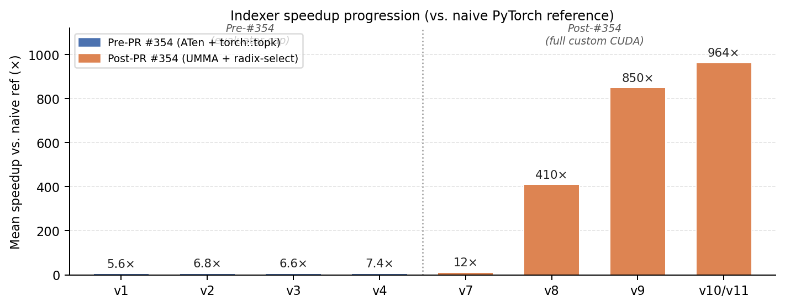
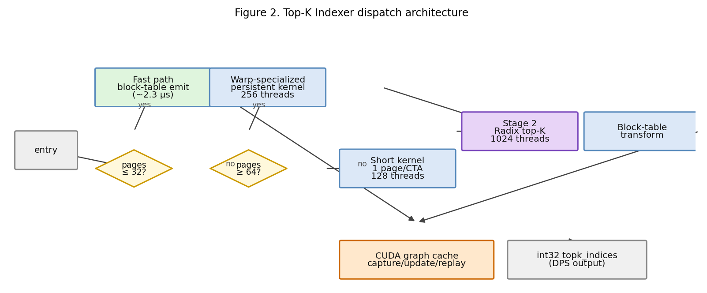
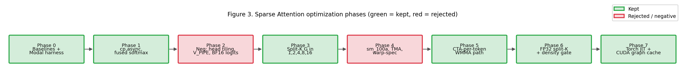
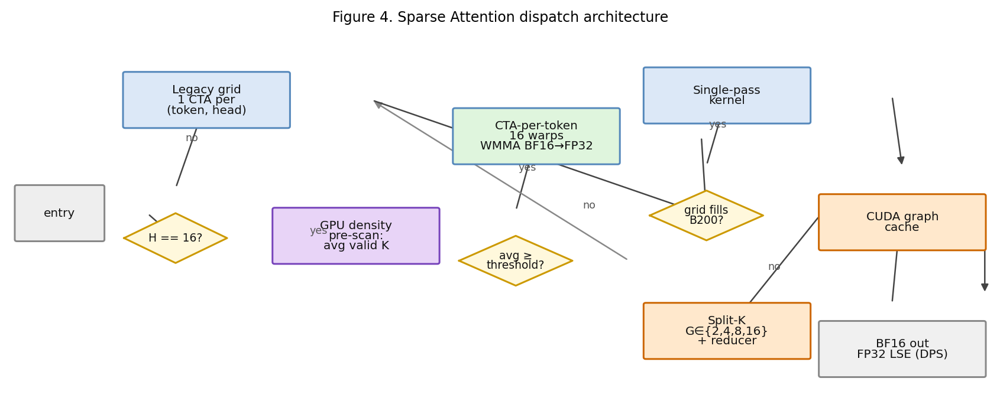

# Joint Optimization of a Top-K Indexer and Sparse Attention Kernel for DeepSeek Sparse Attention on NVIDIA Blackwell

**George Karpenkov &nbsp;&nbsp; Yury Kirpichev &nbsp;&nbsp; Mikhail Usvyatsev**

*Team Wombat — MLSys 2026 FlashInfer AI Kernel Generation Contest, DSA Track (Agent-Assisted Approach), 3rd Place*

---

## Abstract

We present a joint optimization of the two operators that constitute the compute-intensive half of a DeepSeek Sparse Attention (DSA) decoding step on NVIDIA Blackwell (B200, `sm_100a`): a paged FP8 **Top-K Indexer** that scores every cached token against the current query and emits the K = 2048 most relevant indices, and a **Sparse Attention** kernel that consumes those indices over a compressed multi-latent (MLA) KV cache and produces BF16 output with FP32 log-sum-exp in destination-passing style. On the official MLSys 2026 FlashInfer Kernel Generation Contest harness our submissions pass all public workloads — 128/128 indexer, 23/23 attention — and achieve a track-level aggregate **28.96× geometric-mean speedup** against the FlashInfer + DeepGEMM reference baseline; per-kernel speedups are **38.4×** (indexer) and **14.18×** (attention). Both kernels share three structural decisions that proved dominant on B200: (i) *shape- and density-aware host dispatch* over a small set of specialized kernels rather than a single monolithic implementation; (ii) *fused critical loops* — online softmax in attention, and UMMA + radix-select pivot selection in the indexer — to eliminate intermediate HBM traffic; and (iii) a *CUDA Graph cache* keyed by shape and dispatch plan that collapses launch overhead in the small-shape regime where contest workloads are dominated by `cudaLaunchKernel` cost. Development was experiment-driven and agent-assisted; negative results constrained the final designs as much as the positive ones, and we report them explicitly.

**Keywords:** sparse attention; top-K selection; FP8; Blackwell `sm_100a`; UMMA; `tcgen05`; CUDA Graphs; LLM inference; agent-assisted kernel engineering.

---

## 1. Introduction

DeepSeek Sparse Attention (DSA) [11] is a decoding-time mechanism that decouples token selection from value aggregation: a lightweight indexer scores every cached key against the current query and selects the top K most relevant tokens, and a sparse attention kernel then performs full MLA-style attention restricted to those tokens. This factoring exposes two tightly coupled but architecturally distinct problems on modern accelerators. The indexer is a memory-bound, FP8-dominated paged scoring and selection problem in which raw arithmetic throughput is rarely the bottleneck. The sparse attention kernel is a small-batch, online-softmax problem whose performance is governed by occupancy, sparse-index density, and launch overhead at decoding-time batch sizes.

The MLSys 2026 FlashInfer Kernel Generation Contest [16] formalized both operators as separate tracks on NVIDIA B200 (`sm_100a`) with destination-passing-style (DPS) outputs, contest-supplied paged KV layouts, and a baseline composed of `flashinfer_wrapper` and `flashinfer_deepgemm_wrapper`. The contest evaluator measures end-to-end kernel-side latency on a held-out set of representative shapes — 128 indexer, 23 attention — and ranks submissions by geometric-mean speedup against the reference baseline.

We submitted optimized solutions for both tracks. On the official harness our submissions pass every public workload and achieve a 28.96× track-level geometric-mean speedup, finishing **3rd in the DSA track of the agent-assisted division**. Beyond the headline numbers, this report documents the design process that led there: a small set of structural decisions that survived the entire optimization timeline, and a much larger set of micro-optimizations that we measured, characterized, and rejected. We treat negative results as first-class artifacts and report them explicitly.

## 2. Background: The DSA Decoding Pipeline

The two operators form one half of a DSA decoding step on B200. The **Top-K Indexer** scores every paged KV position against the current query and emits the K = 2048 most relevant token indices; the **Sparse Attention** kernel then reads only those 2048 positions out of a compressed MLA KV cache and produces BF16 output and FP32 LSE in destination-passing style. The only data dependency between the two operators is the integer index array output by the indexer.

The 128 indexer workloads and 23 attention workloads each span small to mid-range shapes typical of decoding-time inference, where launch overhead, occupancy, memory scheduling, and sparse-index density are at least as important as raw arithmetic throughput. A single-kernel design cannot serve both small and large regimes well — both submissions ended up as *size- and density-aware host dispatchers* over a small set of specialized kernels, with a CUDA Graph cache wrapping the launch sequence.

**Top-K Indexer problem statement.** For each batch row b, the operator computes FP8 dot products `S[h] = Σ_d Q[b,h,d] · K[page,slot,d]` over H=64 heads and D=128 dimensions with FP32 accumulation, weighted ReLU logits `logit[b,t] = scale[page,slot] · Σ_h ReLU(S[h]) · weights[b,h]` for every position in `[0, seq_lens[b])`, top-K = 2048 selection, and a `block_table` transform back to physical page slots. The KV cache is FP8 with per-slot FP32 scales (132 bytes/slot, 64 slots/page); outputs are pre-allocated (DPS).

**Sparse Attention problem statement.** The operator receives per-token query tensors `q_nope` and `q_pe`, compressed KV caches `ckv_cache` and `kpe_cache`, and TOPK = 2048 sparse indices. It writes a BF16 output tensor and FP32 log-sum-exp tensor in DPS. The practical challenge is not arithmetic intensity but workload distribution: many shapes are small enough that launch overhead, occupancy, and sparse-index density dominate raw throughput.

## 3. Methodology

### 3.1 Experiment-Driven Design

Each candidate optimization was introduced on a branch or named phase, benchmarked on Modal-hosted B200 with `cupti-python` matching the official harness (warmup 3, iterations 100, 5 trials), and either kept, refined, or reverted based on measured numbers. The same data drove accept/reject decisions and post-hoc analysis. We treat the resulting history of negative results as a first-class artifact.

Negative results that were tried and reverted: in the attention kernel — head tiling, deeper value/K prefetch, full warp specialization, BF16 logit storage, TMA gather, large-N Blackwell UMMA; in the indexer — in-Stage-1 ordered-u16 conversion, fused block-table transform in the emit path, `kKVStages` 3→4, and a TMEM double-buffer + MMA-overlap scheme. Documenting why these were rejected is an explicit goal of this report.

### 3.2 Agent-Assisted Development

Development was **agent-assisted**: Cursor with Claude- and GPT-family LLMs was used as a pair-programming and refactoring tool. The agent generated and refactored CUDA C++ and inline PTX code, drafted experiment scaffolding, and prepared diffs for review. All benchmarks, correctness checks, and commit decisions were owned by the human authors, and all changes were accepted only when measured B200 numbers improved. The agent never had access to contest workload data or evaluator outputs beyond what appeared in development logs.

## 4. Top-K Indexer Kernel

### 4.1 Evaluator Constraint (Pre vs. Post PR #354)

The single largest constraint on the timeline was the evaluator. Before [flashinfer-bench PR #354](https://github.com/flashinfer-ai/flashinfer-bench/pull/354) (merged Apr 10, 2026) there was no dedicated `DsaTopkIndexerEvaluator`. The default evaluator compared **raw output index vectors** element-wise. When multiple positions tie on logit value, any custom top-K — radix select, CUB sort, atomic emit — produced a valid top-K set that the evaluator rejected as `INCORRECT_NUMERICAL` because the index ordering did not match the reference's tie-breaking. In practice the only top-K path that reliably passed was `torch::topk`.

**Pre-#354 (v1–v4, Mar 29 – Apr 6), ceiling ~7×.** The early kernel was constrained to ATen ops: a fused FP8 page-gather + dequant CUDA kernel, then `torch::bmm` for Q·K, ATen `relu` + weighted sum, and `torch::topk`. More aggressive ideas (fused Q·K dot products, per-row scoring, BF16 reduction, chunked GEMM with running top-K) were tried and reverted because they broke index-level agreement.

**Post-#354 (Apr 11 onward).** PR #354 introduced `DsaTopkIndexerEvaluator` which compares **sorted value vectors**, vectorizes index validation (duplicates, out-of-range, block-table reachability), and provides a `build_baseline` with correct FP8 packing. Within ten days the solution was rewritten from scratch: pure PyTorch FP8 dequant + bmm indexer (Apr 11–12); custom CUDA top-K with CUB radix sort and FP8 MMA logits via `mma.sync.m16n8k32.e4m3` PTX (Apr 19–20); a full SM100a UMMA rewrite with `tcgen05.mma.cta_group::1`, radix-select top-K, and size-aware dispatch (v7, v8, ~16 µs mean); persistent CTAs, warp specialization, Stage-2 SMEM cache, dispatch retuning and a CUDA graph cache (v9–v11). The final 7.83 µs mean / 38.4× vs. FlashInfer was reached on Apr 24.

*Figure 1. The flat plateau at v1–v4 corresponds to the period when the old evaluator capped progress; the sharp rise at v7–v8 follows PR #354 and the UMMA + radix-select rewrite; the final 13% from v9 to v11 comes from CUDA-graph overhead elimination.*

### 4.2 Final Indexer Design

A host dispatcher selects between three Stage-1 variants plus a fast-path bypass; Stage-2 is a radix top-K; a hand-rolled CUDA graph cache wraps the whole launch sequence.

**Fast path** (`max_num_pages ≤ 32`). When the entire paged context fits within K = 2048, every position is in the top-K, so the output is just a block-table-transformed `[0, seq_len)` padded with −1, independent of Q, K, and weights. Implementation: 128 threads with vectorized `int4` stores, ~2.3 µs including graph replay overhead.

**Short kernel** (`33 ≤ max_num_pages < 64`). One CTA per page, 128 threads. Q and K are loaded into 128B-swizzled SMEM, TMEM is allocated, UMMA is issued with 4 K-iterations on the `(M=128, N=64, K=32)` shape, FP32 accumulators are read back, ReLU-weighted logits are computed, and FP16 is emitted.

**Warp-specialized persistent kernel** (`max_num_pages ≥ 64`). 256 threads = producer warpgroup (warps 4–7, 40 registers, 3-stage `cp.async` K pipeline) and math warpgroup (warps 0–3, 232 registers, issues UMMA, reads TMEM, computes ReLU/weighted sum, emits). Q is loaded once and TMEM is allocated once per CTA. Per-stage `K_ready[buf]`/`K_done[buf]` mbarriers drive the handoff. A subtle bring-up issue: `cp.async.wait_group` is per-thread, so a producer-warpgroup `bar.sync` is required before the single-thread `mbarrier.arrive` on `K_ready[buf]` to ensure all threads' `cp.async` writes are visible.

**Stage-2 radix top-K.** Two-round radix select over 16-bit ordered keys finds the pivot in O(seq_len). Since `seq_len ≤ 16384` for all benchmarked workloads, ordered keys are cached in a 32 KB SMEM array on round 0 and re-read on subsequent passes (4× fewer HBM reads). Elements exceeding the pivot are emitted first; equal-to-pivot elements fill remaining slots; then the block-table transform runs.

### 4.3 Negative Results and the Critical Path

The most useful single finding was that the per-tile critical path in the persistent kernel is **dominated by the TMEM-to-register transfer** (`tcgen05_ld_32x32b_x64_b32` + `tcgen05_wait_ld`), not by MMA compute, producer-prefetch latency, or the FMA accumulation chain.

Levers measured and rejected:

- *TMEM double-buffer + MMA-issue overlap:* +3.6–5.2% — MMA is not on the critical path.
- *kKVStages 3→4:* flat — producer is not the bottleneck.
- *4-way accumulator split:* within noise — FMA chain already hidden behind `wait_ld`.
- *Block-scaled UMMA `mxf8f6f4`:* infeasible — the data format uses per-row FP32 scales, not per-K-block UE8M0.
- *Host-side `seq_lens.max()` sync:* +20 µs from `cudaStreamSynchronize` alone.

Every micro-optimization adding work to the post-`wait_ld` emit path regressed the 40–63 page bucket by 0.6–3.7% by lengthening the critical path between successive TMEM loads. The only structural way to reduce `wait_ld` cost is to shrink `kUMMA_N` via 2-CTA cluster UMMA, deferred due to infrastructure complexity. Micro-optimizations that did stick: Stage-2 ordered-u16 SMEM cache, `int4`-vectorized fast-path stores, and re-tuning the persistent dispatch threshold from `≥ 40` to `≥ 64` pages (recovers 8.9% on the 40–63 page bucket where the short kernel saturates B200's 148 SMs faster than the persistent pipeline).

## 5. Sparse Attention Kernel

### 5.1 Design Evolution

Development proceeded through eight phases. Three principles survived to the final solution:

1. **Reduce repeated HBM traffic.** `v5_fused` collapsed logit computation, softmax, and value accumulation into a single-pass online-softmax K loop that consumes each sparse KV tile exactly once, eliminating a full `TOPK`-length intermediate logit array.
2. **BF16 only at the output boundary.** Intermediate logits and split-K partials in BF16 caused intermittent `abs_err` spikes. The final split-K path uses FP32 partial buffers and converts to BF16 only on the final write.
3. **Treat workloads as shape/density families.** Three correct paths plus a GPU-side density gate.

### 5.2 Final Attention Design

**Legacy kernel.** One CTA per `(token, head)`. Sparse indices are pre-scanned with vectorized `int4` loads; invalid entries are canonicalized to −1 and zero-filled in shared memory rather than fetched. The K loop is fused (load tile → logits → online softmax update → value accumulate), keeping memory traffic close to one use per tile.

**Split-K.** For grids that underfill B200, a split factor G ∈ {2, 4, 8, 16} runs G partial kernels emitting FP32 partial output, max, and normalizer buffers; a reducer combines the G online-softmax states with the same max/sum rescaling identity and writes BF16 + FP32 LSE.

**CTA-per-token (`H=16`).** One CTA per token, one warp per head, with WMMA BF16×BF16→FP32 on both logit and value-accumulation steps. This converts the 16-head batch into tensor-core-shaped work while keeping online-softmax state per head. MMA scratch and output scratch share SMEM overlays because their lifetimes are disjoint.

**Density pre-scan and routing.** A GPU pre-scan counts valid sparse-index entries and routes high-density shapes to the CTA-per-token path; low-density shapes fall back to the legacy grid. A post-deadline study ([six configurations, per-workload tables](https://github.com/ykirpichev/dsa_sparse_attention_h16_ckv512_kpe64_topk2048_ps64/blob/reports/submission-final-v2-draft/artifacts/density_cache_vs_shape_dispatch/REPORT.md)) showed that a sync-free shape rule (`T ≥ 8 → CTA-per-token`) achieves 157× mean speedup — slightly better than the density-cache variant (156×) — by avoiding two low-T cases where the threshold mis-routed to the slower path.

### 5.3 Negative Results

Blackwell `tcgen05.mma`/UMMA expected far larger N than the skinny-GEMM-shaped value accumulation here provides; full warp specialization was correct but issue-slot limited; TMA/gather variants and deeper pipelines lost to the simpler `cp.async` path. The final design is deliberately not "use every Blackwell feature."

This is the **opposite finding** to the indexer: the indexer's Stage-1 has a square-ish `(M=128, N=64, K=32)` UMMA shape that maps cleanly to Blackwell tensor memory, while the attention's value accumulation is a skinny GEMM along a small head dimension where UMMA overhead dominates.

## 6. Shared Infrastructure: CUDA Graph Cache

Both kernels use the same hand-rolled in-extension graph cache. The contest `do_bench` harness clones inputs every iteration so pointers change but shapes (and the dispatch plan) stay fixed. For small workloads where the kernel itself is single-digit microseconds, ~2.5 µs per `cudaLaunchKernel` dominated. The cache is keyed by `(stream, dispatch_path, shape, scale_bits, split_factor, ...)` — no tensor pointers. Each call captures a fresh graph with current pointers and tries `cudaGraphExecUpdate` against the cached exec; on topology mismatch the entry is re-instantiated. Falls back to direct launch if `cudaStreamBeginCapture` fails. In the indexer this collapsed the fast-path bucket from 6.5 µs to 2.3 µs mean.

The cache state machine: on kernel entry, capture a new graph via `cudaStreamBeginCapture`/`cudaStreamEndCapture`; look up the cache by shape key; on hit, call `cudaGraphExecUpdate` to redirect the existing exec's node pointers to the new graph; on success, call `cudaGraphLaunch`; on topology mismatch or miss, call `cudaGraphInstantiate` to create a new exec and cache it.

## 7. Evaluation

### 7.1 Official Contest Results

All submissions were evaluated on the MLSys 2026 FlashInfer Kernel Generation Contest harness against `flashinfer_wrapper_5af199` and `flashinfer_deepgemm_wrapper_2ba145`.

| Kernel | Workloads | Speedup vs. FlashInfer/DG | Track speedup |
|:-------|:---------:|:-------------------------:|:-------------:|
| Top-K Indexer (FP8) | 128 / 128 PASS | 38.4× mean (8.3× worst, 72.3× best) | — |
| Sparse Attention (BF16) | 23 / 23 PASS | 14.18× mean | — |
| **DSA Track (joint)** | **151 / 151** | — | **28.96× geomean** |

Sparse attention correctness: `abs_err ≤ 1.56 × 10⁻²` on all 23 workloads.

### 7.2 Development Benchmarks

Development benchmarks were collected on Modal B200 with `cupti-python` (warmup 3, iterations 100, 5 trials) matching the official evaluation methodology.

| Metric | Top-K Indexer | Sparse Attention |
|:-------|:-------------:|:----------------:|
| vs. naive / PyTorch ref | 964× mean | 126.03× |
| vs. FlashInfer / DeepGEMM | 38.4× mean | 14.18× |
| Aggregate latency | 7.83 µs mean, 2.40 µs p50, 17.80 µs p95 | 0.719 ms total (vs. 6.793 ms FlashInfer, 66.079 ms ref) |

### 7.3 Per-Workload Latency

Official per-workload submission latency (milliseconds), keyed by public workload UUID.

**DSA Attention (23 workloads)**

| UUID | Latency (ms) | UUID | Latency (ms) | UUID | Latency (ms) |
|:----:|:------------:|:----:|:------------:|:----:|:------------:|
| `0c23b10c` | 0.003 | `9f3f891b` | 0.019 | `232ed014` | 0.051 |
| `fc85411e` | 0.004 | `05f6de65` | 0.023 | `7a389715` | 0.051 |
| `9d4a5f21` | 0.004 | `4c46a94b` | 0.036 | `2207f0fd` | 0.051 |
| `f77df5ce` | 0.004 | `385742b2` | 0.038 | `78b2e11c` | 0.051 |
| `0a63b87b` | 0.006 | `ddfa9e34` | 0.050 | `5096e459` | 0.051 |
| `b7668cfd` | 0.006 | `38389961` | 0.051 | `d57eb9e1` | 0.051 |
| `e6b849f2` | 0.008 | `02d6ae9c` | 0.051 | `ae4219a9` | 0.051 |
| `68d6817d` | 0.009 | `564007ac` | 0.052 | | |

**DSA Indexer latency distribution (128 workloads): 69 workloads at 0.002 ms, 14 at 0.011 ms, 10 at 0.012 ms, 8 at 0.013 ms, 5 at 0.014 ms, 5 at 0.016 ms, 10 at 0.017 ms, 6 at 0.018 ms, 1 at 0.017–0.018 ms.** Full per-UUID table is available in the supplemental artifacts at [reports/submission-v10.md](https://github.com/ykirpichev/dsa_topk_indexer_fp8_h64_d128_topk2048_ps64/blob/writeup/reports/submission-v10.md).

## 8. Discussion

### 8.1 Shared Structure

Both kernels independently converged on the same three structural choices: shape-aware dispatch, fused critical loops (eliminating intermediate HBM traffic), and CUDA graph caching for launch overhead. This convergence was not planned — it emerged from measured performance on the same evaluation harness, suggesting that these three properties reflect genuine characteristics of B200 decoding-time workloads rather than problem-specific quirks.

### 8.2 Blackwell Feature Selectivity

The two kernels differ sharply in which Blackwell hardware features are beneficial. The indexer's Stage-1 computation has a square-ish `(M=128, N=64, K=32)` shape that maps cleanly to UMMA (`tcgen05.mma`) and tensor memory. The attention's value accumulation is a skinny GEMM where UMMA overhead exceeds benefit; WMMA via the legacy `nvcuda::wmma` interface suffices. This asymmetry — UMMA beneficial in one kernel, counterproductive in the other — illustrates that hardware feature applicability on Blackwell is shape-sensitive and must be evaluated empirically.

### 8.3 Evaluator Infrastructure as a Timeline Constraint

The pre-#354 evaluator capped indexer progress at ~7× for six weeks. The post-#354 evaluator enabled the full custom CUDA pipeline that delivered 38.4× in the remaining two weeks. This is a lesson for future competitions: correct and representative evaluation infrastructure is as important as hardware access.

## 9. Related Work

**FlashAttention family** [1, 2] established IO-aware attention with online softmax. Our fused K-loop in the attention kernel applies the same principle. **Flash-Decoding** [3] introduced split-K parallelism for multi-head decoding; our split-K path for sparse attention is a direct application. **FlashAttention-4** [4] documents asymmetric scaling, 2-CTA MMA, and TMEM intermediates on Blackwell, providing context for our UMMA and TMEM decisions. The **DeepGEMM** `sm100_fp8_paged_mqa_logits.cuh` reference kernel uses warp specialization and TMA pipelines for a related FP8 scoring problem; our persistent kernel shares structural similarities. The **CUB** radix sort and selection primitives provided a baseline for our custom radix-select Stage-2. **CUTLASS** Blackwell documentation and `umma_desc.h` bitfield layouts were vendored for self-containment. The **FlashInfer** library [9] is the contest baseline.

## 10. Conclusion

We presented joint optimizations of a paged FP8 Top-K Indexer and Sparse Attention kernel for DSA decoding on NVIDIA B200, achieving 38.4× and 14.18× speedups versus the FlashInfer + DeepGEMM reference baseline and a 28.96× track-level geometric-mean speedup in the MLSys 2026 contest. The dominant performance levers — shape-aware dispatch, fused loops, and CUDA graph caching — emerged independently in both kernels from experiment-driven optimization against the same harness. Negative results were as informative as positive ones: TMEM readout, not MMA compute, is the critical path in the FP8 indexer; WMMA, not UMMA, is the correct tensor-core interface for the sparse attention value accumulation. Both findings contradict a naive "use the newest hardware feature" heuristic and reinforce the importance of direct measurement over architectural intuition.

---

## AI / Agent-Assisted Development Disclosure

Both submissions were agent-assisted (Cursor + Claude/GPT-family LLMs); direction and acceptance criteria were human, and all changes were accepted only when measured B200 numbers improved. The agent was used as a pair-programming and refactoring tool for code generation, inline PTX wrapper authoring, and experiment scaffolding. All design decisions (kernel architecture, dispatch thresholds, pipeline depth, optimization accept/reject) were made by the human authors based on benchmark measurements. The agent never had access to contest workload data or evaluation results beyond what was visible in the development logs.

---

## References

[1] T. Dao, D. Fu, S. Ermon, A. Rudra, C. Ré. "FlashAttention: Fast and Memory-Efficient Exact Attention with IO-Awareness." *NeurIPS*, 2022. arXiv:2205.14135.

[2] T. Dao. "FlashAttention-2: Faster Attention with Better Parallelism and Work Partitioning." *ICLR*, 2024. arXiv:2307.08691.

[3] T. Dao, D. Haziza, F. Massa, G. Sizov. "Flash-Decoding for long-context inference." *CRFM Blog*, Stanford, Oct 2023.

[4] T. Dao et al. "FlashAttention-4." arXiv:2603.05451, Mar 2026.

[5] NVIDIA. "CUTLASS: CUDA Templates for Linear Algebra Subroutines." 2024. `tcgen05.mma.kind::f8f6f4`, cta_group=2, SmemDescriptor/InstrDescriptor layouts.

[6] Colfax Research. "Writing GEMM Kernels Using Tensor Memory For Blackwell GPUs." 2025.

[7] DeepGEMM contributors. `sm100_fp8_paged_mqa_logits.cuh` — reference production kernel. 2026.

[8] NVIDIA. *CUDA C++ Programming Guide*. CUDA Graphs / `cudaGraphExecUpdate`; `nvcuda::wmma`. 2025.

[9] Z. Ye, L. Chen, R. Lai, W. Lin, Y. She, S. Sun, B. Zhang, H. Shi. "FlashInfer: Efficient and Customizable Attention Engine for LLM Inference Serving." *MLSys*, 2025.

[10] NVIDIA. *PTX ISA Reference*, `tcgen05.mma`, `tcgen05.alloc`, `cp.async`, mbarrier. 2025.

[11] DeepSeek-AI. "DeepSeek-V2: A Strong, Economical, and Efficient Mixture-of-Experts Language Model." arXiv:2405.04434, 2024.

[12] PyTorch contributors. `torch.utils.cpp_extension.load` — JIT C++/CUDA extension compilation. 2025.

[13] W. Merrill et al. / NVIDIA. CUB: device-wide and block-wide radix sort and selection. 2025.

[14] S. Rajbhandari, J. Rasley, O. Ruwase, Y. He. "ZeRO: Memory Optimizations Toward Training Trillion Parameter Models." *SC*, 2020.

[15] A. Katharopoulos, A. Vyas, N. Pappas, F. Fleuret. "Transformers are RNNs: Fast Autoregressive Transformers with Linear Attention." *ICML*, 2020.

[16] FlashInfer contributors. MLSys 2026 FlashInfer AI Kernel Generation Contest entry definitions. 2026. [github.com/flashinfer-ai/mlsys26-contest](https://github.com/flashinfer-ai/mlsys26-contest).

[17] flashinfer-bench PR #354: `DsaTopkIndexerEvaluator` for correct tie-breaking comparison. [github.com/flashinfer-ai/flashinfer-bench/pull/354](https://github.com/flashinfer-ai/flashinfer-bench/pull/354).

[18] Y. Kirpichev. DSA Top-K Indexer — submitted source (tag `submission-v11`, commit `31b8f71`). [github.com/ykirpichev/dsa_topk_indexer_fp8_h64_d128_topk2048_ps64](https://github.com/ykirpichev/dsa_topk_indexer_fp8_h64_d128_topk2048_ps64).

[19] Y. Kirpichev. DSA Sparse Attention — submitted source (tag `submission-final-v2`, commit `de475b9`). [github.com/ykirpichev/dsa_sparse_attention_h16_ckv512_kpe64_topk2048_ps64](https://github.com/ykirpichev/dsa_sparse_attention_h16_ckv512_kpe64_topk2048_ps64).

[20] Y. Kirpichev. Post-deadline routing study: density cache on/off vs. sync-free shape dispatch. [artifacts/density_cache_vs_shape_dispatch/REPORT.md](https://github.com/ykirpichev/dsa_sparse_attention_h16_ckv512_kpe64_topk2048_ps64/blob/reports/submission-final-v2-draft/artifacts/density_cache_vs_shape_dispatch/REPORT.md).

[21] Y. Kirpichev. DSA track joint process write-up. [final_writeup.md](https://github.com/ykirpichev/dsa_topk_indexer_fp8_h64_d128_topk2048_ps64/blob/writeup/final_writeup.md).
