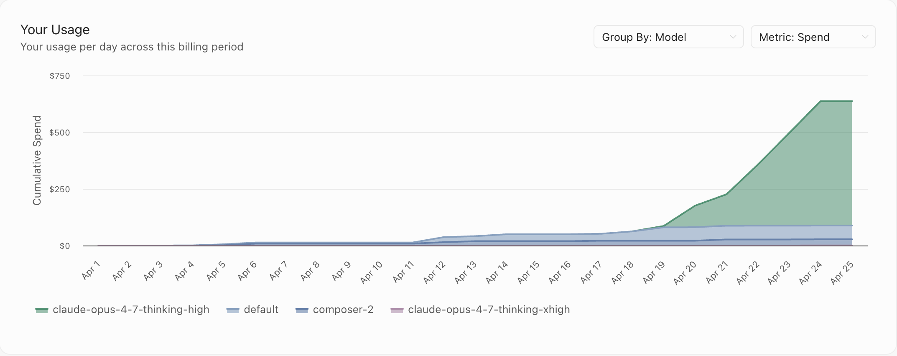

<!-- _class: title -->

# Agent-Assisted Kernel Engineering: *What Actually Worked*

Yury Kirpichev, on behalf of Team Wombat &nbsp;·&nbsp; MLSys 2026 · FlashInfer Contest · DSA Track

3rd place &nbsp;·&nbsp; 28.96× geomean speedup &nbsp;·&nbsp; NVIDIA B200 (sm_100a)

---

<!-- _class: story -->

## Two phases

<h3>Phase 1 · Cursor cloud agents</h3>

Mar – early Apr · old evaluator

<ul>
  <li>Focused only on DSA Indexer kernel</li>
  <li>Cursor $20/mo → $60 (Apr 4)</li>
  <li>Claude $20/mo</li>
  <li>Cursor cloud agents, async supervision mode, many branches</li>
  <li>Operations must be numerically stable to pass evaluation</li>
</ul>

Ceiling: ~7× speedup

<h3>Phase 2 · tight sync loop · 2 weeks</h3>

Apr 21 – May · tight sync loop

<ul>
  <li>Cursor bumped to $200/mo</li>
  <li>Claude $20/mo</li>
  <li>Started using Opus 4.7 (was available at 50% price)</li>
  <li>Interim results email: top 3 at ~11× DSA</li>
  <li>Updated evaluator → full custom CUDA pipeline:
    <ul>
      <li>UMMA kernels, warp specialization, radix select, inline PTX…</li>
    </ul>
  </li>
</ul>

38.4× indexer &nbsp;·&nbsp; 14.18× attention &nbsp;·&nbsp; 28.96× track

<figure>

<figcaption>Indexer speedup — ~7× plateau, then cliff after PR #354</figcaption>
</figure>
<figure>

<figcaption>Switched to Opus 4.7 + interim results email (top 3, ~11× DSA) → spending spike</figcaption>
</figure>

---

<!-- _class: tech -->

## What the agents produced

<h3>Top-K Indexer (FP8)</h3>
<ul>
  <li><strong>FP8 UMMA</strong> logit scoring — <code>tcgen05.mma</code> (M=128,N=64,K=32)</li>
  <li><strong>3-path host dispatch:</strong> fast / short / warp-spec persistent</li>
  <li>Fast path: block-table only, int4 stores</li>
  <li>Warp specialization: producer 40 regs ↔ math 232 regs, mbarrier handoff</li>
  <li>Stage-2 <strong>radix top-K,</strong> 32 KB SMEM ordered-key cache</li>
  <li>Critical path = TMEM readout, not MMA (confirmed by measurement)</li>
</ul>

<h3>Sparse Attention (BF16)</h3>
<ul>
  <li><strong>Fused online-softmax K-loop</strong> — one HBM pass per KV tile</li>
  <li><strong>CTA-per-token WMMA</strong> for H=16 (tensor-core shaped)</li>
  <li>Split-K with FP32 partial buffers + reducer for underfill grids</li>
  <li>GPU density pre-scan → route high/low-density shapes</li>
  <li>WMMA beats UMMA here: skinny head GEMM, overhead > benefit</li>
</ul>

<h3>Shared</h3>
<ul>
  <li>Shape-aware host dispatch everywhere</li>
  <li>~50 micro-opts measured and reverted; only wins kept</li>
</ul>

  

38.4×

Indexer vs FlashInfer

  

  

14.18×

Attention vs DeepGEMM

  

  

28.96×

Geomean · DSA Track

  

  

151/151

Workloads PASS

---

<!-- _class: recipe -->

## The playbook

1
<h3>Fast feedback loop</h3>

Smoke tests for correctness, perf tests only when implementation is ready. Never run the full suite during exploration.

2
<h3>Incremental hypothesis</h3>

One change at a time, measured on real B200 hardware. Reject immediately if numbers don't improve.

3
<h3>Explore in parallel</h3>

Cursor cloud agents exploring different hypotheses concurrently. Phase 1: async review. Phase 2: serial tight loop.

4
<h3>Auto-track +/−</h3>

Every experiment logged. Negative results treated as first-class — ~50 micro-opts tried and reverted, all documented.

5
<h3>Numbers decide</h3>

Accept/reject based on measured numbers only — agent confidence is not evidence.

6
<h3>Revert aggressively</h3>

If it doesn't measure better, it goes. No "promising but needs more work." Keeps the baseline clean for the next hypothesis.

---

<!-- _class: tldr -->

## TL;DR

1

Baseline

Start from the strongest available baseline. Every optimization is only as meaningful as what you measure it against.

2

Environment

Smoke tests + B200 access + fast iterations = agents outpace manual development.

3

Compute

Modal B200 compute, $200/mo Cursor. Unlocked warp specialization, TMEM, inline PTX, radix sort — all agent-generated.

4

Agents

Amplify you &gt;10× — and that's conservative. With the right setup, agents redefine what's possible.

Agents are ready. Is your workflow?

Next time

Fix measurement tooling on day one — bad benchmarks reject good ideas

Next time

Use Cursor cloud agents and Claude more aggressively — still learning the right workflow

github.com/ykirpichev/dsa_topk_indexer_fp8_h64_d128_topk2048_ps64 &nbsp;·&nbsp;
github.com/ykirpichev/dsa_sparse_attention_h16_ckv512_kpe64_topk2048_ps64

---

<!-- _class: thanks -->

## Thank You

mlsys26-contest-contact@nvidia.com &nbsp;·&nbsp; discord.gg/XEH5wGKXZA (GPU Mode #flashinfer)

Conference Host

MLSys 2026 Bellevue, WA · May 18–22

Contest Organizer

FlashInfer AI Kernel Generation Contest

Benchmark & Baseline

FlashInfer team &amp; flashinfer-bench

Compute Sponsor

B200 GPU access for development &amp; benchmarking

mlsys.org &nbsp;·&nbsp; mlsys26.flashinfer.ai

